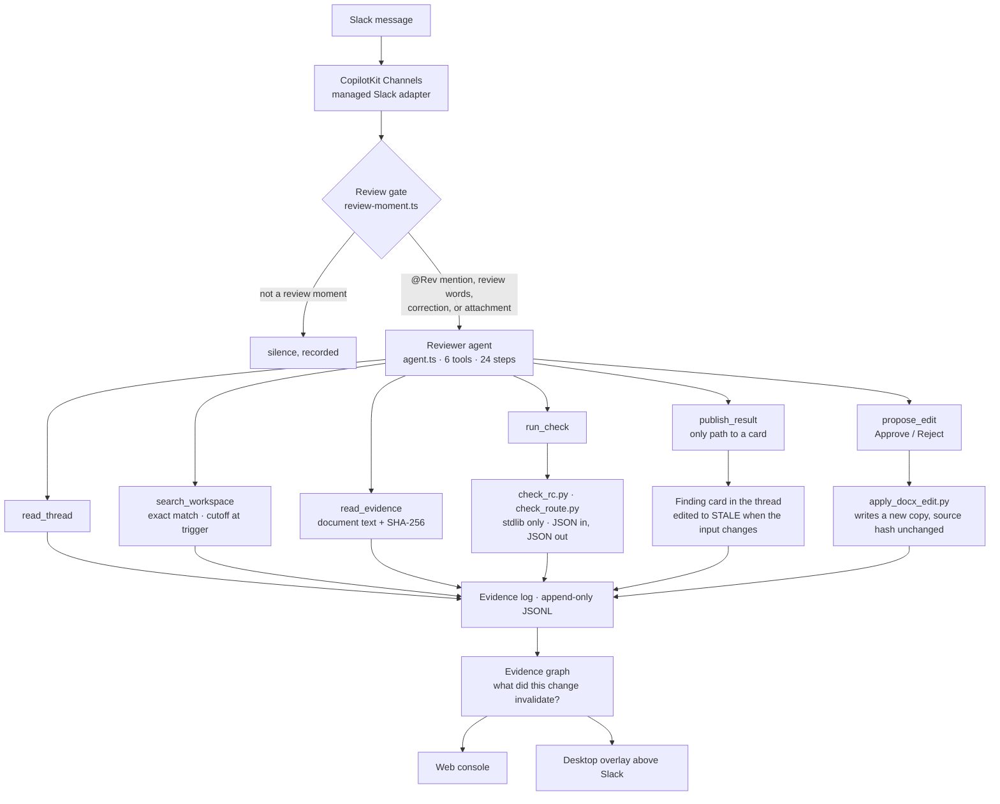

<div align="center">

<picture>
  <source media="(prefers-color-scheme: dark)" srcset="assets/threadrev-logo-dark.svg">
  
</picture>

**A Slack-native engineering change reviewer.** Rev reads the thread, searches the rest of the workspace, recomputes every number with a local checker, and marks its own card stale when the inputs change.

Slack keeps the conversation. ThreadRev keeps the decision, what it was decided against, and whether it is still true.

[**See it**](#see-it) · [**Judging criteria**](#how-threadrev-meets-the-judging-criteria) · [**How it works**](#how-it-works) · [**Run it**](#run-it) · [**Status**](#status)

</div>


Built on September 12, 2026 at the [Agents, Everywhere](https://aitinkerers.org/hackathons/global/agents-everywhere) hackathon, on top of CopilotKit's [agents-everywhere-starter-kit](https://github.com/CopilotKit/agents-everywhere-starter-kit). Everything the reviewer does was written during the event; the split is in [What we built and what we inherited](#what-we-built-and-what-we-inherited).

**Demo video (2 min):** _link added at submission_ · **Repository:** [github.com/gabegraves/ThreadRev](https://github.com/gabegraves/ThreadRev) · **Web console:** [threadrev-web.vercel.app](https://threadrev-web.vercel.app)

---

## Contents

**Start here**
1. [The problem, in one thread](#the-problem-in-one-thread)
2. [What Rev does about it](#what-rev-does-about-it)
3. [See it](#see-it)
4. [How ThreadRev meets the judging criteria](#how-threadrev-meets-the-judging-criteria)
5. [Why this cannot be a chatbox](#why-this-cannot-be-a-chatbox)

**How it is built**
6. [How it works](#how-it-works): one review turn, the six tools, the parts
7. [Trust guarantees and failure handling](#trust-guarantees-and-failure-handling)
8. [Approval workflow](#approval-workflow-rev-proposes-a-person-approves-rev-writes-a-copy)
9. [The scenarios](#the-scenarios)

**Positioning**
10. [What Slack already does, and what ThreadRev adds](#what-slack-already-does-and-what-threadrev-adds)
11. [Why search by identifier, not RAG](#why-search-by-identifier-not-rag)

**Proof and practicalities**
12. [Status](#status): live versus sample, verification, what is not true yet
13. [Run it](#run-it)
14. [Sponsor technologies](#sponsor-technologies)
15. [What we built and what we inherited](#what-we-built-and-what-we-inherited)
16. [Repo map, team rules, research](#repo-map)

---

## The problem, in one thread

Engineering teams make decisions in Slack threads and then write documents that quietly disagree with them. A review document prints a result computed from a capacitance the thread already replaced. A simulation request pulls parameters from a sheet that a correction message superseded three weeks earlier. Nobody catches it, because nobody rereads the thread.

Kestrel Motors (fictional) is building the KS-4, a light electric city vehicle. In `#ks4-electrical`:

> **Dara** (electrical lead) posts `precharge-review-r2.docx`: "Dropped one film cap, bus is now 680 uF."
> **Tam** (firmware): "Relay close timer in firmware is 2.5 s, matches the doc."
> **Juno** (joined in August, has to sign the review): "@Rev can you check section 3 of the r2 doc before I sign?"

The thread reads as settled. It is not. Section 3 of the document says 680 uF, the section 2 diagram says 750 uF, and the printed charge time only reproduces with 750. Two weeks earlier, in `#ks4-purchasing`, Dara ordered a snubber bank that puts the bus at 820 uF, which pushes charge time past the relay timer. If the relay closes before the bus is charged, every key-on puts the inrush through the main contactor. The number in the signed review is the number that ships.

Ask Slack AI to summarize this thread and it says exactly what was said. The summary is accurate, and wrong.

## What Rev does about it

Rev lives in the channel. When someone asks it to check a document, or when a message changes an input that an earlier finding depended on, it reads the thread, searches every other channel for the document and the values it rests on, recomputes the numbers with a local checker, and posts **one card**: the discrepancy, the engineering consequence, the sources with hashes and revisions, which numbers were reproduced versus inferred, and who can resolve it.

Three verbs a summary never does:

| | What it means | Where it lives |
|---|---|---|
| **Recompute** | A stdlib-only Python checker reproduces every number. The model never writes a result; `publish_result` copies the checker's output onto the card. | [`checkers/`](checkers/), [`run_check` and `publish_result`](apps/channel/src/reviewer-tools.tsx) |
| **Bind to a revision** | Every card names the document revision, its SHA-256, and the Slack timestamp of the last requirement change it was computed against. | [`revision.ts`](apps/channel/src/revision.ts), [`finding.ts`](packages/agent-core/src/contracts/finding.ts) |
| **Go stale** | When a later message changes an input, the old card is edited to **STALE** in place and a new card bound to the new revision is posted. A result whose revision moved mid-run is refused before it posts. | [`publish-guard.ts`](apps/channel/src/replay/publish-guard.ts), [`finding-card.tsx`](apps/channel/src/finding-card.tsx) |

And two rules shape everything else: **the model never computes a number that appears on a card**, and **a possible contradiction is not automatically a finding**. Rev stays silent on normal chatter, posts a clean card when everything reproduces, and asks a named person instead of deciding when the evidence conflicts.

---

## See it


<sub>The web review console reading the Scenario A evidence log: Card 1, the correction that made it stale, and Card 2 bound to the correction. The Slack card is the product; the console is a viewer over the same log at <a href="https://threadrev-web.vercel.app">threadrev-web.vercel.app</a>.</sub>

**Live, in a real Slack workspace, with the live model.** On September 12 at 19:22:30Z, forty seconds after an `@Rev` mention in `#ks4-electrical`, Rev posted Card 1 (finding `fnd-mtyrv4yj-y70h`) and then the section 4 proposed-edit card with Approve/Reject buttons. Between the mention and the card: `read_thread`, seven `search_workspace` calls, `read_evidence`, and one RC checker run. The record is in [`STATUS.md`](STATUS.md) (3:22 PM entry) and the model transcript in [`evals/records/model/scenario-a.1.json`](evals/records/model/scenario-a.1.json).

What the card says, in Scenario A:

1. **Card 1.** Section 3 says 680 uF, the section 2 diagram says 750 uF, and the printed 2.435 s only reproduces at 750 uF; at 680 uF it is 2.208 s. The section 4 worked example prints 6.91 s; recomputed, 6.493 s. Question to Dara: which capacitance is right. Full card: [`contracts/examples/finding-scenario-a.json`](contracts/examples/finding-scenario-a.json).
2. **Dara:** "Bus is 820 uF, not 680. Doc will be r3."
3. **Card 1 goes STALE. Card 2.** At 820 uF, t<sub>99.9</sub> = 2.662 s, later than the 2.5 s relay timer; the bus is at 99.85 % when the relay closes. The timer or the resistor must change. Bound to Dara's message, because r3 does not exist yet. [`finding-scenario-a-superseding.json`](contracts/examples/finding-scenario-a-superseding.json).

The three things a reader can check on every card: the checker run id (rerun it), the source hashes (open the same bytes), and the revision (see whether the thread has moved since).

---

## How ThreadRev meets the judging criteria

Judges score 1 to 5 per criterion. The table gives the 5-point language, what ThreadRev does about it, and where to verify.

| Criterion, and what a 5 requires | ThreadRev | Verify |
|---|---|---|
| **Core Requirements & Functionality** — _robust, reliable, and fully functional within its intended environment_ | The full workflow ran live in Slack with the live model: mention → thread read → cross-channel search → document hash → checker run → finding card → proposed-edit card with buttons. Offline, a replay harness drives the real tools and real checkers through six scenarios and asserts the posted card. 204 tests. | [Status](#status); [`STATUS.md`](STATUS.md) 3:22 entry; [`evals/records/`](evals/records/); [`apps/channel/src/replay/`](apps/channel/src/replay/) |
| **Innovation & Theme Alignment** — _a surprising new agent pattern whose central value could not be reproduced in a standalone chatbox_ | The card is bound to the thread's own clock and edited in place when the thread moves on. The correction that invalidates the document is found in a different channel. Approval happens with buttons in the thread, next to the evidence. None of that exists in a chatbox that receives pasted text. | [Why this cannot be a chatbox](#why-this-cannot-be-a-chatbox); [`revision.ts`](apps/channel/src/revision.ts); [`workspace.ts`](apps/channel/src/workspace.ts) |
| **Technical Execution & Integration** — _robust orchestration, thoughtful failure handling, and a deeply integrated architecture_ | Six tools with one path to a card; a fail-closed freshness guard; stale marking in place; an approve-before-write gate with three hard refusals; stdlib checkers behind JSON I/O; an append-only evidence log with a graph that answers "what did this change invalidate"; a replay harness. A live failure at 19:03Z was root-caused from the log and fixed in one commit. | [How it works](#how-it-works); [Trust guarantees](#trust-guarantees-and-failure-handling); [`reviewer-tools.tsx`](apps/channel/src/reviewer-tools.tsx); [`evidence/`](packages/agent-core/src/evidence/) |
| **Usefulness & Agentic Experience** — _native to its environment, using context intelligently while remaining clear and controllable_ | One card, in the thread where the question was asked, with the discrepancy, why it matters, hashed sources, the run id, and who to ask. Nothing is written without a click. Silence on normal chatter. A desktop companion above the Slack window turns red while a finding is unseen. | [`finding-card.tsx`](apps/channel/src/finding-card.tsx); [Approval workflow](#approval-workflow-rev-proposes-a-person-approves-rev-writes-a-copy); [`apps/pet/`](apps/pet/) |

---

## Why this cannot be a chatbox

The theme asks what becomes possible when the agent shows up where the work already happens. For ThreadRev, five things need the Slack surface and disappear without it.

| Needs Slack | Why a chatbox cannot do it |
|---|---|
| **The revision clock.** A card binds to the `ts` of the last requirement-change message in the thread. | Pasted text has no ordered, timestamped sequence to bind to, so there is no revision and nothing to go stale against. |
| **The cross-channel correction.** Dara's 820 uF order was posted in `#ks4-purchasing`, weeks before Juno asked. `search_workspace` finds it by unit, with a cutoff at the trigger. | A chatbox sees only what you paste. Pasting the thread loses the other channel, which is where the correction was. |
| **Editing the card to STALE in place.** The old card is a live message. When the input changes, Rev edits that message and posts a new card under it. | Chat replies are immutable. A new answer sits next to the old one and nothing marks which is current. |
| **Approve buttons in the thread.** `propose_edit` posts Block Kit buttons under the finding. Clicking Approve there approves that finding, in context, next to the evidence. | A chatbox cannot leave a persistent control in the channel that produced the document. |
| **Silence.** Rev reads every message in its channels and speaks only when the review gate fires. | A chatbox speaks when prompted. Rev's value is speaking unprompted when it matters, and not otherwise, which requires being in the channel. |

---

## How it works

### One review turn

What happens between a message and a card:

1. **A message arrives** through CopilotKit's managed Slack adapter. An `@Rev` mention always starts a review. Any other message passes through a code-level gate ([`review-moment.ts`](apps/channel/src/review-moment.ts)): review vocabulary, revision words, corrections, or an attachment open the gate; everything else is recorded as `silence` and gets no model call.
2. **The reviewer agent runs** ([`agent.ts`](apps/channel/src/agent.ts), prompt in [`reviewer-prompt.ts`](packages/agent-core/src/reviewer-prompt.ts)) with six tools and a 24-step budget. It reads the thread, searches the workspace for the documents and units in play, extracts and hashes the document, and asks a checker to recompute.
3. **A checker recomputes.** `run_check` spawns a stdlib-only Python script with a JSON request on stdin and reads a JSON response with named checks, expected and actual values, and a run id.
4. **`publish_result` decides whether a card may post.** It re-reads the thread, compares the revision the run was bound to against the revision now, and refuses if the thread moved. It validates the finding against the contract, copies the checker's numbers, and posts the card. If the card supersedes an earlier one, that one is edited to STALE.
5. **`propose_edit`, when a printed result does not reproduce and its inputs are not in dispute,** posts an Approve/Reject card and stops. Nothing is written until a person clicks.
6. **Everything is logged.** Every message read, search, document hash, checker run, published or refused card, silence decision, and edit event is appended to the evidence log, which the web console and the desktop overlay read.



### The six tools

All in [`apps/channel/src/reviewer-tools.tsx`](apps/channel/src/reviewer-tools.tsx).

| Tool | What it does | What it refuses |
|---|---|---|
| `read_thread` | Reads the Slack thread history: author, timestamp, text, attachments. | |
| `search_workspace` | Queries the workspace index outside the thread by document name, unit, quantity word, or author. Returns every match at or before the trigger, oldest first, and says `truncated: true` if it hit the result cap. | Results after the trigger, so a later message can never be mistaken for a prior decision. |
| `read_evidence` | Extracts document text and computes its SHA-256 through [`extractors/docx_text.py`](extractors/docx_text.py). | Files outside the document store. |
| `run_check` | Runs a checker as a subprocess and records the run with the thread revision at that moment. | |
| `publish_result` | The only path to a card. Validates the finding, copies the checker's numbers, refuses if the thread's revision moved, edits the superseded card to STALE, posts. | A stale run; a finding that fails the contract; a number not from a checker run; a duplicate. |
| `propose_edit` | Posts an Approve/Reject card for one exact text replacement; on Approve, runs [`apply_docx_edit.py`](checkers/apply_docx_edit.py) to write a new copy. | A replacement number the checker did not produce; find-text without a number; text that does not occur exactly once. |

### The parts

| Part | Where | Notes |
|---|---|---|
| Review gate and silence | [`review-moment.ts`](apps/channel/src/review-moment.ts), [`channel.tsx`](apps/channel/src/channel.tsx) | Most messages get nothing. The gate is code, not a prompt instruction. |
| Revision tracking | [`revision.ts`](apps/channel/src/revision.ts) | A requirement-change message becomes the revision every later card binds to. |
| Workspace index | [`workspace.ts`](apps/channel/src/workspace.ts) | Built from a Slack export ([`fixtures/workspace/`](fixtures/workspace/), five channels, March to August; `WORKSPACE_EXPORT` points at a real one). Every message indexed by document, unit, quantity word, change wording, author. No embeddings, no ranking. |
| Checkers | [`checkers/`](checkers/), contract [`contracts/checker-io.md`](contracts/checker-io.md) | `check_rc.py`, first-order RC precharge timing. `check_route.py`, constant-speed route energy. No network, no file writes, standard library only. |
| Finding contract and card | [`finding.ts`](packages/agent-core/src/contracts/finding.ts), [`finding-card.tsx`](apps/channel/src/finding-card.tsx) | Discrepancy, why it matters, sources with revision and hash, reproduced versus inferred, resolution, question, checker run. Rendered as Block Kit from one component tree. |
| Evidence log and graph | [`packages/agent-core/src/evidence/`](packages/agent-core/src/evidence/) | Eleven event kinds. `buildEvidenceGraph` turns the log into message, document, run, finding, and revision nodes; `downstreamOf` walks what a change invalidated. |
| Replay harness | [`apps/channel/src/replay/`](apps/channel/src/replay/) | Replays a fixture Slack script through the real channel handlers and real checkers, with a scripted agent standing in for the model, and asserts the card. `npm run replay:record -- <fixture> --model` runs the real model instead. |
| Web review console | [`apps/web/src/components/review-console/`](apps/web/src/components/review-console/), [`/api/evidence`](apps/web/src/app/api/evidence/route.ts) | Thread, cards, and evidence graph in a browser. Polls the live log, falls back to the Scenario A sample. Deployed at [threadrev-web.vercel.app](https://threadrev-web.vercel.app). |
| Desktop companion | [`apps/pet/`](apps/pet/) | Rev as a frameless, always-on-top Electron overlay parked above the Slack window. Polls [`/api/pet/findings`](apps/web/src/app/api/pet/); red and moving while a live finding is unseen, yellow when the newest finding is stale, green otherwise. `--endpoint=<url>` points it at any web server. |

---

## Trust guarantees and failure handling

| Guarantee | Mechanism | Where |
|---|---|---|
| **The model never writes a number.** | `publish_result` copies `reproduced` values from the checker response and rejects a card whose numbers did not come from a run. | [`reviewer-tools.tsx`](apps/channel/src/reviewer-tools.tsx) |
| **A stale result never posts.** Fail closed. | Before posting, `publish_result` re-reads the thread and compares the revision the run was bound to against the current one. Mismatch: the run is recorded as `publish_refused`, the model is told to re-read and re-run. | [`publish-guard.ts`](apps/channel/src/replay/publish-guard.ts); test RC3 in [`replay.test.tsx`](apps/channel/src/replay/replay.test.tsx) |
| **Stale means marked, not deleted.** | The superseded card is edited in place to STALE with its original finding, sources, and run id still visible, and the new card names what it replaces. | [`finding-card.tsx`](apps/channel/src/finding-card.tsx) |
| **No write without a click.** | `propose_edit` ends the model's turn at the card. The write runs inside the button handler. The original file is never opened for writing; a new copy is written and both hashes are returned. | [`apply_docx_edit.py`](checkers/apply_docx_edit.py); [Approval workflow](#approval-workflow-rev-proposes-a-person-approves-rev-writes-a-copy) |
| **Checkers are isolated.** | Standard library only, JSON on stdin and stdout, no network, no file writes, run as a subprocess with a timeout. Every card carries the run id so anyone can rerun it. | [`checkers/`](checkers/), [`contracts/checker-io.md`](contracts/checker-io.md) |
| **Conflicts become questions.** | When two sources disagree and neither is authoritative, the checker evaluates both and the card asks a named person which applies. It never picks. | RC2 in [`fixtures/slack/rc2-conflict.json`](fixtures/slack/rc2-conflict.json), [`finding-rc2-conflict.json`](contracts/examples/finding-rc2-conflict.json) |
| **Silence is the default.** | The gate runs before the model. A message that opens the gate can still end in `NO_FINDING`, which is suppressed and logged. | [`review-moment.ts`](apps/channel/src/review-moment.ts), [`channel.tsx`](apps/channel/src/channel.tsx) |
| **Everything is auditable.** | Append-only JSONL. Every read, search, hash, run, card, refusal, silence, and edit event. The log is the input to the console and the graph, and it is how the live failure below was diagnosed. | [`evidence/log.ts`](packages/agent-core/src/evidence/log.ts) |

**A real failure, handled.** The first live attempt at 19:03Z posted nothing. The model had passed `publish_result` a revision string copied from a fixture message it saw through `search_workspace`; the live thread's revision was the message's `occurredAt`. The guard compared the strings, refused the card as stale, and the re-read plus re-run exhausted the 10-step budget. The refusal was in the evidence log. Fix, in one commit (`21b6295`): `run_check` records the thread revision at run time and cards bind to that, and the reviewer gets 24 steps. The next attempt posted Card 1 in 40 seconds. Full account in [`STATUS.md`](STATUS.md) (4:20 PM entry).

---

## Approval workflow: Rev proposes, a person approves, Rev writes a copy

Rev never edits a file on its own. When a printed result does not reproduce and the inputs it came from are not in dispute, it proposes the exact replacement and waits.

**1. Rev proposes.** After the finding card, the model calls `propose_edit` with the text to find and the checker's value. The tool refuses any replacement number the checker did not produce, any find-text without a number, and any text that does not occur exactly once. If it passes, this card posts in the thread and the model's turn ends:

```
Proposed edit: needs approval

precharge-review-r2.docx (r2) · sha b63f3e53bb26
• section 4, line 13: `t = 6.91 s` → `t = 6.493 s`
  (printed value does not reproduce at 2 mF; checker gives 6.4933 s)

Replacement values are copied from checker run rc-20260912T180314Z-7f3f.
Rev only proposes replacing a printed result; it never changes an input
or a design value.

Nothing has been written. Approve to write the new file; the source
stays untouched.

[ Approve and write the file ]   [ Reject ]
```

**2. A person decides.** Reject redraws the card to "rejected by <name>, nothing was written" and records it. Approve redraws it to "approved, writing", then runs [`checkers/apply_docx_edit.py`](checkers/apply_docx_edit.py): stdlib only, applies the replacement inside the document XML, writes a new file next to the original, returns both hashes.

**3. The card shows the result.**

```
Proposed edit: applied
Applied, approved by Juno Marsh. New file `precharge-review-r2-proposed.docx`
sha 839e48a591bc. Source b63f3e53bb26 untouched.
```

Three events land in the log (`edit_proposed`, `edit_decided`, `edit_applied`), each with the proposal id, run id, and both hashes; the console timeline shows them in order.

What cannot happen: a write without a click, a number the checker did not produce, a change to an input or a design value, a modified original, a second decision on the same proposal. In Scenario A the section 3 timing is not proposed, because its capacitance is the open question to Dara; only the fixed 2 mF worked example in section 4 qualifies.

Tests: the proposal card, approval writing the new file with the source hash unchanged, the refused value, and the editor's exactly-once rule, in [`replay.test.tsx`](apps/channel/src/replay/replay.test.tsx) and [`checkers/test_checkers.py`](checkers/test_checkers.py).

---

## The scenarios

Every scenario is a fixture Slack script under [`fixtures/slack/`](fixtures/slack/), a finding example under [`contracts/examples/`](contracts/examples/), and a recorded harness run under [`evals/records/scripted/`](evals/records/scripted/). The documents, people, and Slack history are synthetic ([`fixtures/README.md`](fixtures/README.md), spec in [`research/synthetic-fixture-spec.md`](research/synthetic-fixture-spec.md)).

| Scenario | What it proves | Fixture |
|---|---|---|
| **A** — precharge review | The full beat: Card 1, correction, Card 1 STALE, Card 2, section 4 edit proposal. Ran live in Slack with the live model. | [`scenario-a.json`](fixtures/slack/scenario-a.json) |
| **A, cross-channel** | The 820 uF correction was posted two weeks earlier in `#ks4-purchasing`. The thread alone cannot catch it; `search_workspace` by unit `uF` does, and the card cites the purchasing message by channel and timestamp. | [`scenario-a-cross.json`](fixtures/slack/scenario-a-cross.json) |
| **B** — stale simulation inputs | A route-energy request in `#ks4-strategy-sim` pulls a mass from a parameter sheet that a correction superseded. `check_route.py` evaluates both sheets; the conclusion flips between them. | [`scenario-b.json`](fixtures/slack/scenario-b.json) |
| **RC1** — clean control | Every value reproduces. The card says so and suggests no change. Proves Rev does not manufacture findings. | [`rc1-clean.json`](fixtures/slack/rc1-clean.json) |
| **RC2** — conflicting evidence | Two sources give two masses, neither final. Both are computed in one run and the card asks Milo which applies. Proves Rev asks instead of picking. | [`rc2-conflict.json`](fixtures/slack/rc2-conflict.json) |
| **RC3** — mid-run revision | A requirement changes while the checker is running. The first result is refused before it posts. Proves the guard fails closed. | [`rc3-midrun.json`](fixtures/slack/rc3-midrun.json) |

---

## What Slack already does, and what ThreadRev adds

Slack AI tells you what was said. ThreadRev tells you what was decided, and whether it still holds. ThreadRev does not compete on search, summaries, scheduled skills, or page edits; it adds the three verbs above, which none of those do.

| | Slack AI summary or search | ThreadRev card |
|---|---|---|
| Numbers | Repeats what the text says | Recomputed by a stdlib Python checker. The model never writes a number on a card. |
| Version | Answers about "the doc" | Names the docx revision and SHA-256, and binds the card to the timestamp of the latest requirement change. |
| Later corrections | The earlier summary stays as written next to the new one | The earlier card is edited to STALE in place and a new card bound to the new revision is posted. A result whose revision moved mid-run is refused. |
| Fixing the document | An integration edits a page when told to | Proposes the exact replacement with the checker's value and two buttons. Writes a new copy only after approval; the original keeps its hash. |
| Silence | Answers when asked | Silent on normal chatter, a clean card when everything reproduces, a question instead of a decision when sources conflict. |

<details>
<summary>What we are building toward, and how much exists on <code>main</code> today</summary>

| Difference to prove | In practice | Today |
|---|---|---|
| Which decisions still apply | Separate proposals, accepted decisions, and superseded conclusions; tie each to its component and revision | Built narrowly: every card binds to a revision; a later change marks it stale; conflicting sources produce a question, not a pick |
| A reviewable evidence trail | Exact source versions, assumptions, conflicting evidence, and the record of changes | Built: the evidence log records every message read, document hash, checker run, card, and silence decision; the graph answers "what did this change invalidate" |
| Check the underlying work | Reproduce the calculation; keep runnable checks another engineer or agent can inspect | Built: `checkers/`, `run_check`, `publish_result`, run ids on every card |
| Continue existing work correctly | Update the right task, carry unresolved questions forward, never turn a tentative discussion into a decision or open a duplicate | Not built. The historical supplier-acceptance case in the research notes is the target. |

What we do not claim: a market gap ([`research/engineering-change-competitors.md`](research/engineering-change-competitors.md)), that Slack cannot be configured to approximate this, or that a summary is the wrong tool for open-ended questions.

</details>

## Why search by identifier, not RAG

Retrieval-augmented generation ranks chunks by similarity to the question and puts the top few in the prompt. That is right when the corpus is too large to read and the question is open-ended. It is wrong for a reviewer, for three reasons that shaped this design.

1. **A ranking can drop the one message that matters.** The correction that invalidates a document is a short message, often in the wrong channel, that says "820, not 680." Nothing about it is semantically close to "check section 3 of the r2 doc." ThreadRev searches by the identifiers an engineer would grep for: document name, unit, quantity word, author. It returns every match up to the trigger, so the correction is in the set or it is not in the workspace. There is a result cap, and a search that hits it says so; an unannounced cap would lose a correction exactly the way a ranking does.
2. **The model never computes a number.** RAG hands text to the model and the model reasons over it, arithmetic included. Here the model extracts candidate values, a checker recomputes them, and the card copies the checker. What the model retrieves affects which inputs get checked, never what a result is.
3. **Answers are bound to a revision and go stale.** A RAG answer stands until someone asks again. A card is bound to the timestamp of the latest change it was computed against, and the log records every message read, including the ones found by search, so "what did this change invalidate" is a graph query.

The workspace index is retrieval: exact match over a structured index, with a cutoff, with the numbers verified afterward and the result tied to a revision.

---

## Status

As of 3:45 PM EDT, September 12, 2026. The live board is [`STATUS.md`](STATUS.md); the submission record is [`submission/final-submission.md`](submission/final-submission.md).

### Live versus sample

| Part | Status |
|---|---|
| `@Rev` mention in `#ks4-electrical`, Kestrel Motors workspace, 19:22:30Z | **Live Slack, live model** (`gpt-5.6-sol` through CopilotKit Channels). Card 1 posted 40 s after the mention, `fnd-mtyrv4yj-y70h`, bound to the thread revision, then the proposed-edit card with Approve/Reject. Not a script. |
| Live model inference, offline harness | **Verified** at 3:50 PM: `gpt-5.6-sol`, 45 s, 12 tool calls, Card 1 as scripted plus the section 4 proposal ([`scenario-a.1.json`](evals/records/model/scenario-a.1.json)); `gpt-5.6-luna`, 26 s, 9 calls, Card 1 also citing the purchasing 820 uF message ([`scenario-a.2.json`](evals/records/model/scenario-a.2.json)). |
| Card 1 STALE marker, Card 2, the Approve click | **Not yet live.** A correction posted in the live thread at 19:27Z produced no reviewer turn and no log line; the cause is not known. The whole beat is proven end to end in the replay harness with the scripted reviewer, not with the live model. |
| Kestrel Motors, its people, documents, and Slack history | Synthetic fixtures under [`fixtures/`](fixtures/). |
| Workspace index | Built from the fixture export. `WORKSPACE_EXPORT` can point at a real one. |
| Web console | Public deploy, reads the evidence log, falls back to the Scenario A sample. A viewer, not the agent. |
| Desktop overlay | Local Electron app, session only. |
| Evidence log | Local JSONL file, session only. Persistent storage (the Convex direction in [`SCRATCHPAD.md`](SCRATCHPAD.md)) is a recorded decision, not implemented. |
| Approved edit output | Written locally on Approve, source never modified. Proven in replay tests; live click pending. |

### Verification

Run at 3:40 PM EDT on `main`:

| Suite | Tests |
|---|---|
| `agent-core` | 56 pass |
| `channel` (replay harness, publish guard, edit approval) | 48 pass |
| `web` | 35 pass |
| `pet` | 53 pass |
| Python checkers and editor | 12 pass |
| **Total** | **204 pass, 0 fail** |

`npm run verify` runs the typecheck first, and in a checkout where `npm ci` has not installed `electron` the `pet` typecheck fails on the missing module before the tests run; `npm ci` clears it. The `agent-core`, `channel`, and `web` typechecks pass.

### Not true yet

- The stale marker, Card 2, and the Approve click have not happened with the live model in Slack.
- No persistent store. A restart loses the evidence log.
- The checkers cover two calculations, RC precharge timing and constant-speed route energy. The pattern generalises; the evidence does not yet.
- Exa is not used: the inherited search capability is not registered on the reviewer and `EXA_API_KEY` is blank.
- The inherited dependency audit has unresolved advisories. This is not a production or security-cleared deployment.

---

## Run it

Node 22+ and Python 3. No accounts are needed for anything except the live Slack connection.

**Install and verify everything**

```sh
git clone https://github.com/gabegraves/ThreadRev.git
cd ThreadRev
npm ci
cp .env.example .env
npm run verify          # typecheck, every test suite, python checkers
```

**Watch the reviewer work, offline**

```sh
npm run test --workspace channel                          # replay harness: six scenarios through the real tools
python3 -m unittest checkers/test_checkers.py             # checkers and the edit writer
python3 checkers/check_rc.py < contracts/examples/checker-rc-request.json   # one checker run, by hand
```

**Web console, offline, on the Scenario A sample**

```sh
npm run dev:web         # http://127.0.0.1:3100
```

**Desktop companion, against that web server**

```sh
npm run dev --workspace pet         # add -- --endpoint=<url> to point elsewhere
```

**Slack, live.** Needs a model key (`OPENAI_API_KEY` or `OPENROUTER_API_KEY`), a CopilotKit Intelligence project key, and a Channel code; steps in [`SETUP.md`](SETUP.md) and the [`.env.example`](.env.example) comments. Managed Channels dial out from this process, so no tunnel is needed.

```sh
npm run channel:status
npm run dev:slack
```

**Run the real model through a fixture** (needs a model key): `npm run replay:record -- scenario-a --model`.

---

## Sponsor technologies

| Sponsor | What it does in ThreadRev | Where |
|---|---|---|
| **CopilotKit Channels** | Hosts the Slack connection with no public tunnel or Socket Mode token. Delivers thread history to `read_thread`, renders the finding card and the proposal card as native Block Kit from one component tree, routes the Approve/Reject clicks back to `propose_edit`, and runs the `BuiltInAgent` tool loop. The reviewer is the application layer; Channels is the Slack layer. | [`channel.tsx`](apps/channel/src/channel.tsx), [`agent.ts`](apps/channel/src/agent.ts), [`finding-card.tsx`](apps/channel/src/finding-card.tsx) |
| **OpenAI** (or OpenRouter) | `gpt-5.6-sol` runs the reviewer: what to read, which checker to run, what to ask, when to propose an edit. It is not trusted with arithmetic; `publish_result` refuses numbers that did not come from a checker run. Any OpenRouter model with tool use can be substituted. | [`model.ts`](packages/agent-core/src/model.ts) |
| **Ambiguous AI** | Inherited, not used by the reviewer. The starter's web follow-up workflow connects to Ambiguous when `AMBIGUOUS_API_KEY` is set and otherwise stores locally; the Slack agent opts out (`workplace: false`). Listed for accuracy, not claimed. | [`workplace.ts`](apps/web/src/lib/server/workplace.ts) |

Exa is not used.

---

## What we built and what we inherited

Baseline commit `9ed46e0`, 11:00 AM EDT on September 12. `git diff --name-only 9ed46e0..HEAD` is the authoritative list.

**Built during the event**

| Area | Where |
|---|---|
| Reviewer: six tools, review gate, silence, revision tracking, evidence recorder, finding card, welcome card | [`apps/channel/src/`](apps/channel/src/) |
| Reviewer prompt; finding, evidence, and checker contracts with examples and tests; evidence log and graph | [`packages/agent-core/src/`](packages/agent-core/src/), [`contracts/`](contracts/) |
| Checkers `check_rc.py`, `check_route.py`; the approved-edit writer `apply_docx_edit.py`; their tests | [`checkers/`](checkers/) |
| Document extractor | [`extractors/`](extractors/) |
| Workspace index, workspace export fixture and generator | [`workspace.ts`](apps/channel/src/workspace.ts), [`fixtures/workspace/`](fixtures/workspace/) |
| Fixtures: documents, Slack scripts, checksums, generator | [`fixtures/`](fixtures/) |
| Replay harness, publish guard, run recorder | [`apps/channel/src/replay/`](apps/channel/src/replay/) |
| Eval records, scripted and model | [`evals/`](evals/) |
| Web review console, `/api/evidence`, `/api/pet/findings` | [`apps/web/src/components/review-console/`](apps/web/src/components/review-console/), [`apps/web/src/app/api/`](apps/web/src/app/api/) |
| Desktop companion | [`apps/pet/`](apps/pet/) |
| Research, fixture spec, design decisions, handoffs | [`RESEARCH.md`](RESEARCH.md), [`research/`](research/) |

**Inherited from the starter** (`agents-everywhere-starter-kit` at `6443333`)

The CopilotKit Channels runtime wiring, the `BuiltInAgent` loop, the managed-gateway test harness pattern, the shared model configuration, the Exa search capability, the incident-response tools and cards in `apps/channel/src/tools.tsx` and `components.tsx` (no longer registered on the channel, kept for their tests), the web app shell and its follow-up workflow, the Ambiguous AI MCP capability, the mobile app, the developer docs, the demo recordings under `assets/demos/`, and the bundled skills under `.agents/`.

---

## Repo map

<details>
<summary>Directories</summary>

```
apps/channel/          Slack agent: reviewer tools, card, gate, replay harness
apps/web/              Web review console, /api/evidence, /api/pet/findings
apps/pet/              Desktop companion (Rev overlay above Slack)
packages/agent-core/   Contracts, evidence log and graph, reviewer prompt, model config
checkers/              Trusted Python checkers, the edit writer, their tests
contracts/             Checker I/O contract and example findings, requests, logs
extractors/            Document text extraction
fixtures/              Synthetic documents, Slack scripts (A, A-cross, B, RC1 to RC3), workspace export
evals/                 Recorded harness runs, scripted and model
research/              Research, fixture spec, design decisions, lane handoffs
submission/            Final submission text and video plan
AGENTS.md              Lane ownership, workspace rules, conventions for coding agents
STATUS.md              Live status board, one line per lane
SCRATCHPAD.md          Accepted decisions
SETUP.md               Environment setup record and verification history
```

</details>

<details>
<summary>Team and working rules</summary>

Five lanes worked on this repo in parallel: backend, web console, demo and submission, Slack environment, and eval / red team. [`AGENTS.md`](AGENTS.md) has the lane table (who owns which directories), the workspace rules (one checkout per agent, stage by explicit path, `main` must always verify, pull-rebase before push), and the Channels API conventions. [`STATUS.md`](STATUS.md) is the board everyone updated after each push. [`CLAUDE.md`](CLAUDE.md) points coding agents at both.

</details>

<details>
<summary>Research</summary>

The reasoning behind the scope, the harness choice, the fixture design, and the competitive audit is in [`RESEARCH.md`](RESEARCH.md) and [`research/`](research/). Start with [`research/hackathon-design.md`](research/hackathon-design.md), [`research/synthetic-fixture-spec.md`](research/synthetic-fixture-spec.md), and [`research/change-agent-novelty-audit.md`](research/change-agent-novelty-audit.md), which names the direct competitors and why we do not claim a market gap.

</details>
