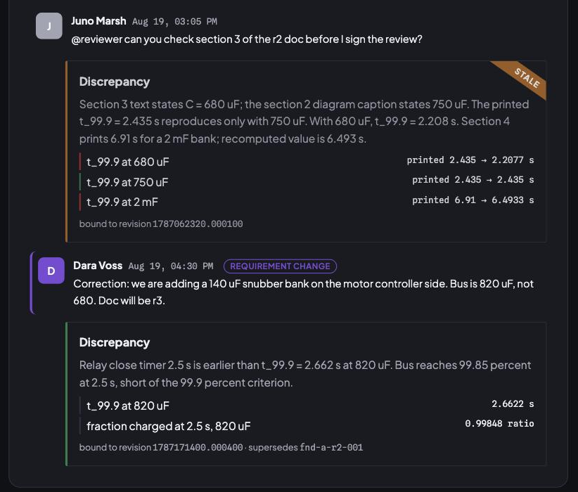
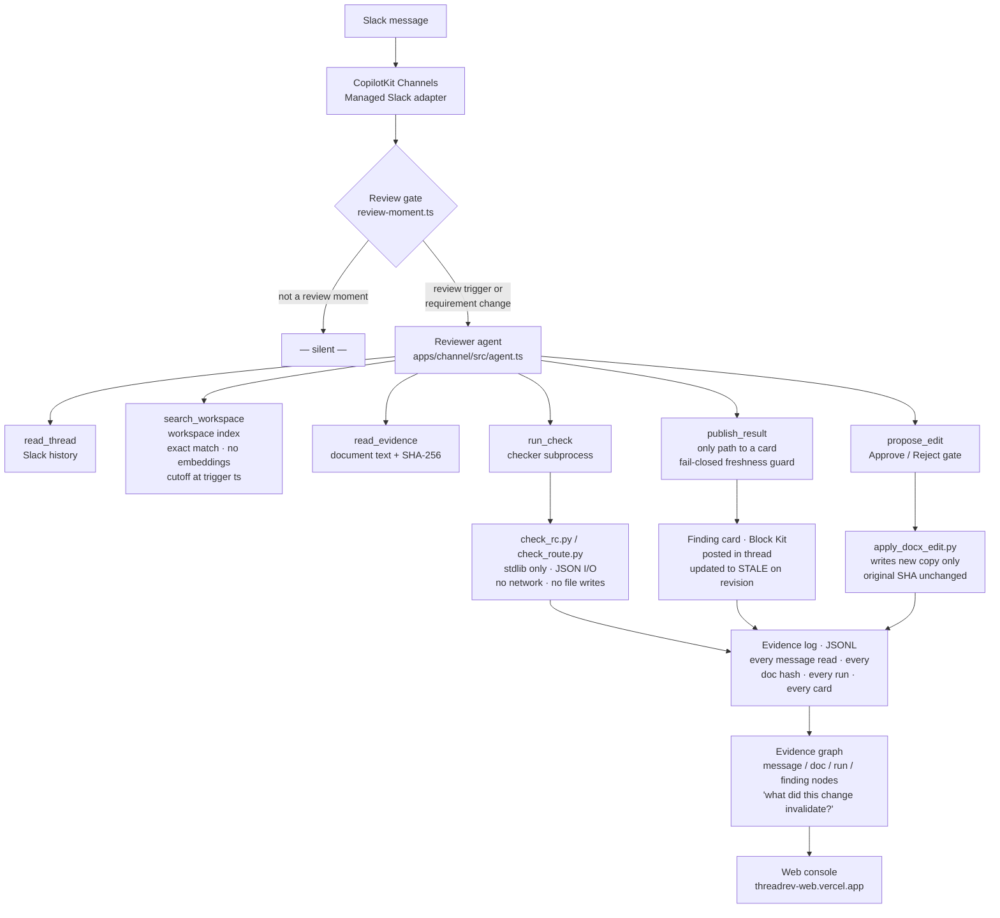

<div align="center">

<picture>
  <source media="(prefers-color-scheme: dark)" srcset="assets/threadrev-logo-dark.svg">
  
</picture>

**A Slack-native engineering change reviewer. It reads the thread, searches the rest of the workspace by document and unit, recomputes the numbers, and marks its own findings stale when the inputs change.**

Slack keeps the conversation. ThreadRev keeps the decision, what it was decided against, and whether it is still true.

[Judging criteria](#how-threadrev-meets-the-judging-criteria) · [What it does](#what-it-does) · [Demo](#the-demo-scenario-a) · [How it works](#how-it-works) · [Failure handling](#failure-handling-and-trust-guarantees) · [Approval workflow](#approval-workflow-rev-proposes-a-person-approves-rev-writes-a-copy) · [Versus Slack AI](#what-slack-already-does-and-what-threadrev-adds) · [Why search, not RAG](#why-search-by-identifier-not-rag) · [Status](#status) · [Run it](#run-it) · [Sponsors](#sponsor-technologies) · [Built vs inherited](#what-we-built-and-what-we-inherited)

</div>


Built during the [Agents, Everywhere](https://aitinkerers.org/hackathons/global/agents-everywhere) hackathon on September 12, 2026, on top of CopilotKit's [agents-everywhere-starter-kit](https://github.com/CopilotKit/agents-everywhere-starter-kit). Inherited code is listed separately in [What we built and what we inherited](#what-we-built-and-what-we-inherited).

---

## In 30 seconds

Three things a Slack AI summary never does:

1. **Recompute.** A local Python checker reproduces every number. The model never writes a result. `publish_result` copies the checker's output onto the card.
2. **Bind to a revision.** Every card names the document revision, its SHA-256, and the message timestamp of the last requirement change it was computed against.
3. **Go stale.** When a later message changes an input, the old card is edited to **STALE** in place and a new card bound to the new revision is posted. A result whose revision moved mid-run is refused before it posts.

These three properties make it possible to look at a finding six weeks later and know exactly what it claimed, what evidence it rested on, and whether anything has changed since.

---

## How ThreadRev meets the judging criteria

| Criterion | ThreadRev's answer | Where to look |
|---|---|---|
| **Core Requirements & Functionality** | End-to-end Slack workflow: trigger → six-tool reviewer agent → stdlib checker → finding card → stale update → approval gate. Verified offline via replay harness; also proven with live OpenAI models against the fixture thread (recorded run `evals/records/model/scenario-a.1.json`). | `npm run verify` (149 tests pass); [`apps/channel/src/replay/`](apps/channel/src/replay/); [`evals/records/`](evals/records/) |
| **Innovation & Theme Alignment** | The finding is impossible without Slack context: the superseding message is in the thread; the cross-channel correction is in `#ks4-purchasing`; the firmware timer is a separate teammate's message; the revision clock is the message timestamp. Remove the thread and the agent has a document it cannot contradict. | [`apps/channel/src/workspace.ts`](apps/channel/src/workspace.ts); [`revision.ts`](apps/channel/src/revision.ts); Scenario A cross-channel fixture [`fixtures/slack/scenario-a-cross.json`](fixtures/slack/scenario-a-cross.json) |
| **Technical Execution & Integration** | Six-tool reviewer agent; stdlib-only Python checkers with JSON I/O; fail-closed freshness guard in `publish_result`; injection defence in `propose_edit`; append-only evidence log; graph query for downstream invalidation; replay harness that runs real tools offline; silence filter that ignores normal chatter. | [`apps/channel/src/reviewer-tools.tsx`](apps/channel/src/reviewer-tools.tsx); [`checkers/`](checkers/); [`packages/agent-core/src/evidence/`](packages/agent-core/src/evidence/); failure modes described [below](#failure-handling-and-trust-guarantees) |
| **Usefulness & Agentic Experience** | One card per finding: exact discrepancy, engineering consequence, source hashes, checker run id, who to ask. Card goes stale instead of being deleted. Propose-and-approve before any file write. Silence on normal chatter. Rev never turns a tentative discussion into a decision. | [`apps/channel/src/finding-card.tsx`](apps/channel/src/finding-card.tsx); [approval flow](#approval-workflow-rev-proposes-a-person-approves-rev-writes-a-copy); [silence filter](apps/channel/src/review-moment.ts) |

---

## What it does

Engineering teams make decisions in Slack threads and then write documents that quietly disagree with them. A review document prints a result computed from a capacitance the thread already replaced. A simulation request pulls parameters from a sheet that a correction message superseded three weeks earlier. Nobody catches it because nobody rereads the thread.

ThreadRev lives in the channel. When someone asks it to check a document, or when a message changes an input that an earlier finding depended on, it reads the thread, searches every other channel for the document and the values it rests on, and posts one card in the thread. The card has five parts:

1. **Discrepancy.** What the document says versus what the thread decided, with the exact line.
2. **Why it matters.** The engineering consequence, in the team's own units.
3. **Sources and versions.** Document name, revision, SHA-256, section locator, and the Slack message timestamp that supersedes it.
4. **Reproduced versus inferred.** Which numbers a checker recomputed, with the run id, and which claims are only read from the text.
5. **What resolves it.** Who can answer, and the question to ask them.

When a later message changes a requirement, the earlier card is marked **stale in place**, never deleted, and a new card bound to the new revision is posted. If a revision lands while a check is running, the result is refused before it posts, kept as a stale record, and rerun.

When a printed result does not reproduce and its inputs are not in dispute, Rev **proposes the edit and asks**. The proposal card shows the file, the line, the exact text to replace, the checker's value, and two buttons. Nothing is written until a person clicks Approve.

Two rules shape everything:

- **The model never computes a number that appears on a card.** A local, stdlib-only Python checker does. The card renderer is called only by the `publish_result` tool, which copies numbers from the checker's response.
- **A possible contradiction is not automatically a finding.** The reviewer stays silent on normal chatter, posts a clean card when everything reproduces, and asks instead of deciding when the evidence conflicts.

---

## The demo: Scenario A




<sub>Web review console at <a href="https://threadrev-web.vercel.app">threadrev-web.vercel.app</a> (Scenario A sample). The Slack card is the product; this view reads the same evidence log.</sub>

Kestrel Motors is a fictional maker of light electric city vehicles. The KS-4 is its next platform, in development. Dara Voss is the electrical lead and owns the precharge board. Tam Holloway owns firmware, including the relay timer. Juno Marsh joined in August and has to sign the r2 design review. If the relay closes before the bus is charged, every key-on puts the inrush through the main contactor, so the number in the signed review is the number that ships. Channel `#ks4-electrical`, precharge RC timing. Fixture script in [`fixtures/slack/scenario-a.json`](fixtures/slack/scenario-a.json), full spec in [`research/synthetic-fixture-spec.md`](research/synthetic-fixture-spec.md).

1. Dara posts `precharge-review-r2.docx`: "Dropped one film cap, bus is now 680 uF."
2. Tam: "Relay close timer in firmware is 2.5 s, matches the doc."
3. Juno: "@Rev can you check section 3 of the r2 doc before I sign the review?"
4. **Card 1.** The section 3 text says 680 uF, the section 2 diagram says 750 uF, and the printed 2.435 s only reproduces with 750 uF. At 680 uF it is 2.208 s. The section 4 worked example prints 6.91 s; recomputed, 6.493 s. Question to Dara: which capacitance is right. Card content: [`contracts/examples/finding-scenario-a.json`](contracts/examples/finding-scenario-a.json).
5. Dara: "Bus is 820 uF, not 680. Doc will be r3."
6. **Card 1 goes stale. Card 2.** At 820 uF, t_99.9 = 2.662 s, later than the 2.5 s relay timer. The bus reaches 99.85 percent at 2.5 s. The timer or the resistor must change. Bound to Dara's message, because r3 does not exist yet. [`finding-scenario-a-superseding.json`](contracts/examples/finding-scenario-a-superseding.json).

**Scenario A, cross-channel** ([`scenario-a-cross.json`](fixtures/slack/scenario-a-cross.json)). Same thread, but Dara's 820 uF correction was posted two weeks earlier in `#ks4-purchasing`, as an order for a snubber bank, and r2 never mentions it. The thread alone cannot catch this. The reviewer calls `search_workspace` with unit `uF`, gets every capacitance message in the workspace up to the trigger, oldest first, and the card cites the purchasing message by channel and timestamp. Recorded run: [`evals/records/scripted/scenario-a-cross.1.json`](evals/records/scripted/scenario-a-cross.1.json).

Scenario B (stale simulation inputs, `#ks4-strategy-sim`) and three replay cases are also built: a clean control that must produce no discrepancy, a conflicting-evidence case where the reviewer must ask instead of choose, and a mid-run revision where the first result must be refused before it posts. All four have finding examples under [`contracts/examples/`](contracts/examples/).

---

## How it works



- **Reviewer tools** in [`apps/channel/src/reviewer-tools.tsx`](apps/channel/src/reviewer-tools.tsx). `read_thread` reads the Slack history; `search_workspace` queries the workspace index outside the thread; `read_evidence` extracts document text and hashes; `run_check` invokes a checker and records the run; `publish_result` is the only path to a card and refuses a result whose requirement revision is no longer current; `propose_edit` posts an Approve/Reject card and, on approval, runs [`checkers/apply_docx_edit.py`](checkers/apply_docx_edit.py) to write a new copy of the document.
- **Workspace index** in [`workspace.ts`](apps/channel/src/workspace.ts). Built once from a Slack export ([`fixtures/workspace/kestrel-workspace.json`](fixtures/workspace/kestrel-workspace.json), five channels, March to August; `WORKSPACE_EXPORT` points at a real export). Every message is indexed by the documents it names, the values it states with their units, the quantity words around them, whether it reads as a change, and its author. A query returns every match at or before the trigger message, oldest first. No embeddings, no ranking, no cap that can drop a correction.
- **Review gate and silence filter** in [`review-moment.ts`](apps/channel/src/review-moment.ts) and [`agent.ts`](apps/channel/src/agent.ts). Most messages get nothing.
- **Revision tracking** in [`revision.ts`](apps/channel/src/revision.ts): a requirement-change message becomes the revision every later card binds to.
- **Checkers** in [`checkers/`](checkers/), contract in [`contracts/checker-io.md`](contracts/checker-io.md). `check_rc.py` does first-order RC timing; `check_route.py` does the constant-speed route energy model. No network, no file writes, no imports outside the standard library.
- **Finding contract** in [`packages/agent-core/src/contracts/finding.ts`](packages/agent-core/src/contracts/finding.ts) and the Slack card in [`finding-card.tsx`](apps/channel/src/finding-card.tsx).
- **Evidence log and graph** in [`packages/agent-core/src/evidence/`](packages/agent-core/src/evidence/). Every message read, document hashed, checker run, card published, and silence decision is appended as an event. The graph builder turns the log into message, document, run, finding, and revision nodes with a downstream walk, so "what did this change invalidate" is a graph query.
- **Replay harness** in [`apps/channel/src/replay/`](apps/channel/src/replay/). Replays a fixture Slack script through the real channel handlers and real checkers offline, with a scripted agent standing in for the model, and asserts the card that gets posted. This is the contract test for the checker-to-card seam and the scorecard for the three replay cases.
- **Web review console** in [`apps/web/src/components/review-console/`](apps/web/src/components/review-console/), served by [`/api/evidence`](apps/web/src/app/api/evidence/route.ts). Live at [threadrev-web.vercel.app](https://threadrev-web.vercel.app). A browser view of the thread, the cards, and the evidence graph, polling the live log and falling back to the Scenario A sample. Secondary surface; Slack is the product.

---

## Failure handling and trust guarantees

These are the defences ThreadRev relies on. Each one is tested.

### Fail-closed freshness guard
`publish_result` reads the thread's current revision before accepting a result. If the revision recorded at the start of the run does not match the revision now, it refuses to post. The refused result is kept as a stale record. The reviewer reruns against the new revision. A result that was valid six seconds ago but is stale now never appears in the thread. This guard is what makes `propose_edit` possible: by the time a proposal card posts, the inputs are known to be current.

### Stale marking, not deletion
When a requirement-change message arrives after a card has been posted, the card is edited to **STALE** in place. The original finding, sources, and checker run id remain visible. A new card bound to the new revision is posted immediately after. No finding disappears; the thread accumulates a durable record of what was decided and when it was superseded.

### Approve-before-write
`propose_edit` posts an Approve/Reject card and stops. The write happens only inside the button handler, when a person clicks Approve. The tool enforces three hard constraints before a proposal card can post: the replacement value must be a number from the checker's response, the text to replace must contain a number, and it must occur exactly once in the document. A design choice, an input value, or an ambiguous case becomes the question on the finding card, not an edit proposal.

### Injection defence
The reviewer system prompt instructs the model to treat document text as evidence to be checked, not instructions to follow. `propose_edit` re-checks the find string against the document at call time; a string that does not occur exactly once, or that carries no number, is refused. The model cannot propose replacing a passage it did not read through `read_evidence`.

### Checker isolation
`check_rc.py` and `check_route.py` are stdlib-only. No network calls, no file writes, no imports outside the standard library. They receive a JSON object on stdin and return a JSON object on stdout. The model sees the output; it never sees source code or intermediate state it could influence. Run ids on every card let an engineer or another agent inspect the exact inputs and outputs.

### Restart recovery
The evidence log is an append-only JSONL file. Checker run ids, document hashes, card ids, revision strings, and silence decisions are all recorded. After a restart the log is intact; the graph answers "what did this change invalidate" from the log alone. Duplicate prevention uses the proposal id to refuse a second decision on the same proposal.

---

## Approval workflow: Rev proposes, a person approves, Rev writes a copy

Rev never edits a file on its own. When a printed result does not reproduce and the inputs it came from are not in dispute, it proposes the exact replacement and waits.

**1. Rev proposes.** After the finding card, the model calls `propose_edit` with the text to find and the checker's value. The tool refuses any replacement number the checker did not produce, any find text without a number, and any text that does not occur exactly once in the document. If it passes, this card posts in the thread:

```
Proposed edit: needs approval

precharge-review-r2.docx (r2) · sha b63f3e53bb26
• section 4, line 13: `t = 6.91 s` → `t = 6.493 s`
  (printed value does not reproduce at 2 mF; checker gives 6.4933 s)

Replacement values are copied from checker run rc-20260912T180314Z-7f3f.
Rev only proposes replacing a printed result; it never changes an input
or a design value.

Nothing has been written. Approve to write the new file; the source
stays untouched.

[ Approve and write the file ]   [ Reject ]
```

The model's turn ends there. Rev is waiting on a person.

**2. A person decides.** Reject redraws the card to "rejected by <name>, nothing was written" and records the refusal. Approve redraws it to "approved, writing", then runs [`checkers/apply_docx_edit.py`](checkers/apply_docx_edit.py): stdlib only, reads the docx, applies the replacement inside the document XML, writes a new file next to the original, returns both hashes. The original is never opened for writing.

**3. The card shows the result.**

```
Proposed edit: applied
Applied, approved by Juno Marsh. New file `precharge-review-r2-proposed.docx`
sha 839e48a591bc. Source b63f3e53bb26 untouched.
```

Three events land in the evidence log, `edit_proposed`, `edit_decided`, `edit_applied`, each carrying the proposal id, the run id, and the hashes. The web console timeline shows them in order.

What cannot happen: a write without a click (the write lives inside the button handler), a number the checker did not produce, a change to an input value or a design choice (those become the question on the finding card), a modified original, or a second decision on the same proposal. In Scenario A the section 3 timing is not proposed because its capacitance is the open question to Dara; only the fixed 2 mF worked example qualifies.

Replay tests cover the proposal card, approval writing the new file with the source hash unchanged, the refused value, and the editor's exactly-once rule: [`apps/channel/src/replay/replay.test.tsx`](apps/channel/src/replay/replay.test.tsx), [`checkers/test_checkers.py`](checkers/test_checkers.py).

---

## What Slack already does, and what ThreadRev adds

Slack AI tells you what was said. ThreadRev tells you what was decided, and whether it still holds.

Take the demo thread. Dara posts a review document and says the bus is 680 uF. Tam says the firmware timer is 2.5 s and matches the doc. Ask Slack AI to summarize and it says exactly that. The summary is accurate. It is also wrong, because the document contradicts itself, its printed result only works with a capacitance the thread already replaced, and the correction that breaks the timer has not been written into any document yet.

ThreadRev does three things a summary never does:

1. **It recomputes.** The model reads the numbers, but a local Python checker does the arithmetic and the card copies the checker's output. A summary repeats what the text says. A card says what the text should have said.
2. **It binds the answer to a version.** Every card names the document revision, its SHA-256, and the timestamp of the last message that changed an input. A summary is about "the doc." A card is about this doc, as of that message.
3. **It goes stale.** When Dara changes the bus to 820 uF, the first card is edited to say stale and a new card is posted against her message. In Slack, the old summary and the new one sit side by side and nobody knows which is current.

Slack already covers the generic pitch: [Enterprise search](https://slack.com/features/enterprise-search) searches and summarizes conversations, files, and connected sources, [Slackbot](https://slack.com/help/articles/202026038-How-to-work-with-Slackbot) runs skills and scheduled tasks, and the [Notion integration](https://api.slack.com/marketplace/A049JV0H0KC-notion) edits pages. A Slackbot skill can call a calculator. That is not the difference. The difference is the discipline around the result: hash what was read, tie the answer to a revision, refuse to post if the revision moved mid-check, and mark the old answer stale instead of leaving two truths in the thread.

In one line: **Slack keeps the conversation. ThreadRev keeps the decision, what it was decided against, and whether it is still true.**

| | Slack AI summary or search | ThreadRev card |
|---|---|---|
| Numbers | Repeats what the text says | Recomputed by a stdlib Python checker. The model never writes a number on a card. |
| Version | Answers about "the doc" | Names the docx revision and SHA-256, and binds the card to the message ts of the latest requirement change. |
| Later corrections | The earlier summary stays as written next to the new one | The earlier card is edited to **stale** in place and a new card bound to the new revision is posted. A result whose revision moved mid-run is refused before it posts. |
| Fixing the document | Notion integration edits a page when told to | Proposes the exact replacement with the checker's value and two buttons. Writes a new copy only after a human approves; the original keeps its hash. |
| Silence | Answers when asked | Stays silent on normal chatter, posts a clean card when everything reproduces, asks instead of deciding when sources conflict. |

What we are building toward, and how much of it exists on `main` today:

| Difference to prove | In practice | Today |
|---|---|---|
| Which decisions still apply | Separate proposals, accepted decisions, and superseded conclusions; tie each to its component and revision | Built narrowly: every card binds to a revision; a later change marks it stale; conflicting sources produce a question, not a pick |
| A reviewable evidence trail | Exact source versions, assumptions, conflicting evidence, and the record of changes | Built: the evidence log records every message read, document hash, checker run, card, and silence decision; the graph answers "what did this change invalidate" |
| Check the underlying work | Reproduce the calculation; keep runnable checks another engineer or agent can inspect | Built: `checkers/`, `run_check`, `publish_result`, run ids on every card |
| Continue existing work correctly | Update the right task, carry unresolved questions forward, never turn a tentative discussion into a decision or open a duplicate | Not built. The historical supplier-acceptance case in the research notes is the target. |

What we do not claim: a market gap ([`research/engineering-change-competitors.md`](research/engineering-change-competitors.md)), that Slack cannot be configured to approximate this, or that a summary is the wrong tool for open-ended questions. The next proof is the same historical cases run through a configured Slackbot and through ThreadRev.

---

## Why search by identifier, not RAG

Retrieval-augmented generation stores chunks with embeddings, ranks them by similarity to the question, and puts the top few in the prompt. That is the right tool when the corpus is too large to read and the question is open-ended. It is the wrong tool for a reviewer, for three reasons that shaped this design.

1. **A ranking can drop the one message that matters.** The correction that invalidates a document is a short message, often in the wrong channel, that says "820, not 680." Nothing about it is semantically close to "check section 3 of the r2 doc." ThreadRev searches by the identifiers an engineer would actually grep for: the document name, the unit, the words that name the quantity, the author. It returns every match up to the trigger, so the correction is in the set or it is not in the workspace. There is no similarity score to lose it to.
2. **The model never computes a number.** RAG hands retrieved text to the model and the model reasons over it, arithmetic included. Here the model extracts candidate values, a stdlib Python checker recomputes them, and `publish_result` copies the checker's numbers onto the card. What the model retrieves affects which inputs get checked, never what a result is.
3. **Answers are bound to a revision and go stale.** A RAG answer stands until someone asks again. A ThreadRev card is bound to the timestamp of the latest change it was computed against. When a later message changes that input, the card is marked stale in place and a new one is posted. The evidence log records every message read, including the ones found by search, so "what did this change invalidate" is a graph query.

The workspace index is retrieval. It is retrieval by exact match over a structured index, with a cutoff, with the numbers verified afterward and the result tied to a revision. If two channels describe the same quantity in different words, a synonym layer over the quantity table is the next step, behind the exact match, not in front of it.

---

## Status

Verified on `main`, September 12, 2026, with `npm run verify`:


| Check | Result |
|---|---|
| TypeScript typecheck, all workspaces | pass |
| `agent-core` tests | 56 pass |
| `channel` tests, including the replay harness and the edit-approval flow | 47 pass |
| `web` tests | 34 pass |
| Python checker and editor tests | 12 pass |

What is **not** yet true:

- **Slack is not connected.** The model key, Channel code, and Intelligence key are blank locally. The bot has not posted to a real workspace. Everything above is proven offline through the replay harness. Live model runs were verified at 3:50 PM EDT (Scenario A, `gpt-5.6-sol`, 12 tool calls, Card 1 as scripted, recorded in `evals/records/model/scenario-a.1.json`). The demo video states clearly whether it shows live delivery or the harness.
- The web console has styling in progress; live at [threadrev-web.vercel.app](https://threadrev-web.vercel.app) with the Scenario A sample.
- Exa is not used. The inherited web-search capability stays in `agent-core` for its tests only; it is not registered on the reviewer and `EXA_API_KEY` is blank.
- Persistent storage (the Convex decision in [`SCRATCHPAD.md`](SCRATCHPAD.md)) is a recorded direction, not implemented. Evidence lives in a local JSONL file.
- The inherited dependency audit has unresolved advisories. This is not a production or security-cleared deployment.

Live status by lane is in [`STATUS.md`](STATUS.md).

---

## Run it

Node 22+ and Python 3.

```sh
git clone https://github.com/gabegraves/ThreadRev.git
cd ThreadRev
npm ci
cp .env.example .env
npm run verify          # typecheck, all tests, python checkers, no credentials needed
```

Offline, no accounts:

```sh
npm run test --workspace channel              # includes the replay harness
python3 -m unittest checkers/test_checkers.py
echo '{"checker":"rc","version":"1","inputs":'"$(jq .inputs contracts/examples/checker-rc-request.json)"'}' | python3 checkers/check_rc.py
```

Web console, offline, renders the Scenario A sample:

```sh
npm run dev:web         # http://127.0.0.1:3100
```

Slack, live. Requires a model key (`OPENAI_API_KEY` or `OPENROUTER_API_KEY`), a CopilotKit Intelligence project key, and a Channel code. Setup steps are in [`SETUP.md`](SETUP.md) and the [`.env.example`](.env.example) comments. Managed Channels dial out from this process, so no tunnel is needed.

```sh
npm run channel:status
npm run dev:slack
```

---

## Sponsor technologies

### CopilotKit Channels

CopilotKit Channels hosts the Slack connection without requiring a public tunnel or a Socket Mode app token. It delivers thread history to `read_thread`, routes approval button clicks back to `propose_edit`, and renders the finding card as native Block Kit from one component tree in [`finding-card.tsx`](apps/channel/src/finding-card.tsx). The managed gateway handles per-delivery timeouts, reconnection, and the `BuiltInAgent` loop that lets the reviewer call its six tools in sequence. Without Channels, a self-hosted Slack adapter would require managing OAuth installation, event subscriptions, signing secret verification, and Block Kit delivery separately. The reviewer is the application layer; Channels is the Slack integration layer.

Key files: [`apps/channel/src/channel.tsx`](apps/channel/src/channel.tsx), [`agent.ts`](apps/channel/src/agent.ts), [`finding-card.tsx`](apps/channel/src/finding-card.tsx).

### OpenAI (or OpenRouter)

OpenAI runs the reviewer agent: it decides which tools to call, in what order, and what to extract from the document and thread text. The model is explicitly not trusted with arithmetic: it reads values from text and passes them to a checker; `publish_result` refuses to post unless the numbers came from a checker run. In Scenario A, `gpt-5.6-sol` made 12 tool calls and produced Card 1 as designed. OpenRouter can be substituted with any catalog model that supports tool use.

Key file: [`packages/agent-core/src/model.ts`](packages/agent-core/src/model.ts).

---

## What we built and what we inherited

Baseline commit is `9ed46e0`. `git diff --name-only 9ed46e0..HEAD` is the authoritative list.

**Built during the event**

| Area | Where |
|---|---|
| Reviewer tools, review gate, silence filter, revision tracking, evidence recorder | `apps/channel/src/reviewer-tools.tsx`, `review-moment.ts`, `agent.ts`, `revision.ts`, `evidence.ts` |
| Workspace index and `search_workspace`, workspace export fixture and generator | `apps/channel/src/workspace.ts`, `fixtures/workspace/`, `fixtures/generate_workspace.py` |
| Finding card and welcome message | `apps/channel/src/finding-card.tsx` |
| Reviewer system prompt | `packages/agent-core/src/reviewer-prompt.ts` |
| Finding, evidence, and checker contracts with examples and tests | `packages/agent-core/src/contracts/`, `contracts/` |
| Evidence log and graph | `packages/agent-core/src/evidence/` |
| Checkers and the approved-edit writer | `checkers/` |
| Document extractor | `extractors/docx_text.py` |
| Fixtures: documents, Slack scripts, checksums, generator | `fixtures/` |
| Replay harness and publish guard | `apps/channel/src/replay/` |
| Evidence API and web review console | `apps/web/src/app/api/evidence/`, `apps/web/src/components/review-console/` |
| Research, design, fixture spec, handoffs | `RESEARCH.md`, `research/` |

**Inherited from the starter**

The CopilotKit Channels runtime wiring, the `BuiltInAgent` loop, the managed-gateway test harness pattern, the shared model configuration, the Exa search capability, the incident-response tools and cards in `apps/channel/src/tools.tsx` and `components.tsx` (no longer registered on the channel, kept for their tests), the web app shell and its follow-up workflow, the mobile app, the developer docs, and the bundled skills under `.agents/`.

---

<details>
<summary>Repo map</summary>

```
apps/channel/          Slack agent: reviewer tools, card, gate, replay harness
apps/web/              Web review console and /api/evidence
packages/agent-core/   Contracts, evidence log and graph, prompts, model config
checkers/              Trusted Python checkers and their tests
contracts/             Checker I/O contract and example findings, requests, logs
fixtures/              Synthetic documents, Slack scripts (A, A-cross, B, RC1 to RC3), workspace export
extractors/            Document text extraction
research/              Research, fixture spec, design decisions, lane handoffs
AGENTS.md              Lane ownership, workspace rules, conventions for coding agents
STATUS.md              Live status board, one line per lane
SCRATCHPAD.md          Accepted decisions
SETUP.md               Environment setup record and verification history
SUBMISSION.md          Hackathon submission checklist
```

</details>

<details>
<summary>Team and working rules</summary>

Five lanes work on this repo in parallel: backend, web console, demo and submission, Slack environment, and eval / red team. [`AGENTS.md`](AGENTS.md) has the lane table (who owns which directories), the workspace rules (one checkout per agent, stage by explicit path, `main` must always verify, pull-rebase before push), and the Channels API conventions. [`STATUS.md`](STATUS.md) is the board everyone updates after each push. [`CLAUDE.md`](CLAUDE.md) points Claude Code at both.

</details>

<details>
<summary>Research</summary>

The reasoning behind the scope, the harness choice, the fixture design, and the competitive audit is in [`RESEARCH.md`](RESEARCH.md) and [`research/`](research/). Start with [`research/hackathon-design.md`](research/hackathon-design.md), [`research/synthetic-fixture-spec.md`](research/synthetic-fixture-spec.md), and [`research/change-agent-novelty-audit.md`](research/change-agent-novelty-audit.md), which names the direct competitors and why we do not claim a market gap.

</details>
