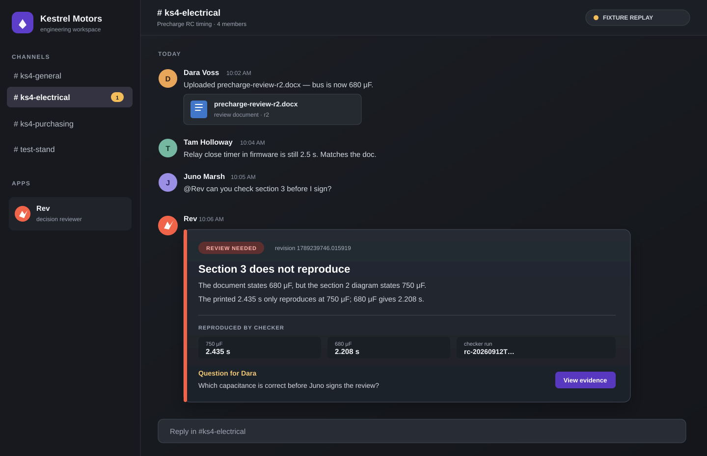
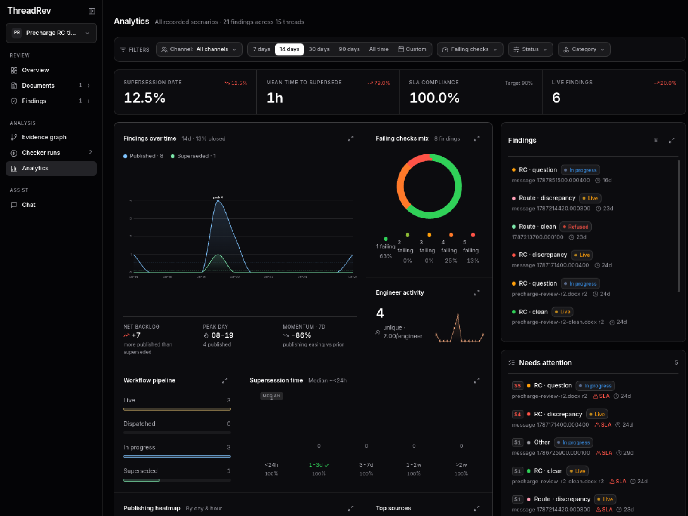
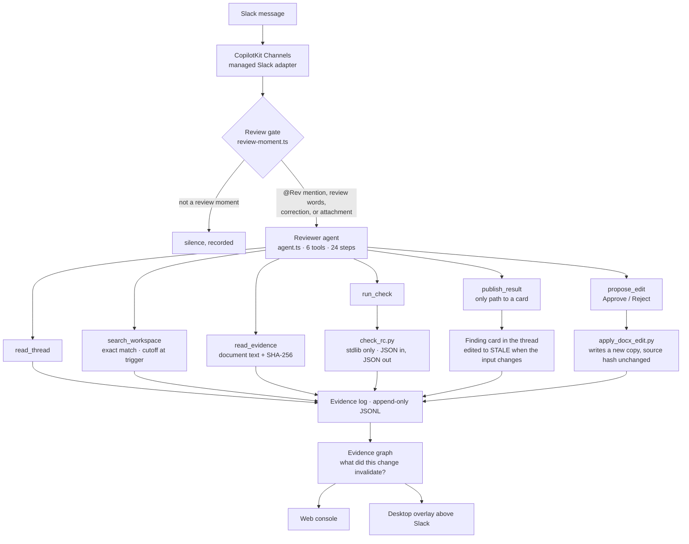

<div align="center">

<picture>
  <source media="(prefers-color-scheme: dark)" srcset="assets/threadrev-logo-dark.svg">
  
</picture>

# ThreadRev

**A Slack-native reviewer for engineering decisions that need to remain true.**

When an engineering document stops matching the decisions around it, Rev traces the evidence, recomputes the supported calculation, and leaves a review card with the exact human decision still needed.

[**Demo video**](https://www.youtube.com/watch?v=GkOk1QYSLWg) · [**Proof**](#proof-at-a-glance) · [**Scenario**](#the-problem-in-one-thread) · [**Why Slack matters**](#why-slack-context-matters) · [**Run it**](#run-it) · [**Architecture**](#how-it-works)

</div>

## Demo video

[](https://www.youtube.com/watch?v=GkOk1QYSLWg)

[Watch on YouTube.](https://www.youtube.com/watch?v=GkOk1QYSLWg)

Built on September 12, 2026 at the [Agents, Everywhere](https://aitinkerers.org/hackathons/global/agents-everywhere) hackathon, on top of CopilotKit's [agents-everywhere-starter-kit](https://github.com/CopilotKit/agents-everywhere-starter-kit). Everything the reviewer does was written during the event; the split is in [What we built and what we inherited](#what-we-built-and-what-we-inherited).

> **Prototype status:** a live `@Rev` mention produced an initial checker-backed Slack card and proposed-edit card. The workspace search and document extraction in this demo use a synthetic Slack export and local DOCX fixtures. Stale replacement and approved-copy output are replay-verified; they have not yet been captured together in one live Slack run. See [the evidence boundary](#live-versus-sample).

## Proof at a glance

| What to inspect | Evidence | Boundary |
|---|---|---|
| **Agent in the work** | A live `@Rev` mention in `#ks4-electrical` posted Card 1 and a proposed-edit card in 40 seconds. | Live Slack + live model; the machine-readable trace is [`scenario-a.1.json`](evals/records/model/scenario-a.1.json). |
| **Decision stays current** | A correction makes Card 1 visibly **STALE** and posts Card 2 bound to the new revision. | Deterministic replay, including real checker and card code. [Inspect the superseding finding.](contracts/examples/finding-scenario-a-superseding.json) |
| **Checker-backed numbers; no autonomous write** | *Reproduced by checker* rows are copied from a named run; a document edit is proposed, then a person approves a new copy. | Replay-verified. The original document remains untouched. |
| **Explore the evidence** | The deployed console shows the decision lifecycle, checker runs, and provenance. | Fixture-backed viewer, not proof of a live Slack session. [Open it.](https://threadrev-web.vercel.app/analytics) |

## Rev in the engineering thread

[](fixtures/slack/scenario-a.json)

**Fixture replay — not a screenshot.** This reconstruction uses the exact Scenario A messages, document values, checker results, and review question. It shows the experience the project is designed around: a decision stays where the team made it, with the source conflict, reproduced values, revision, and human question all in the thread.

## See the decision lifecycle

[](https://threadrev-web.vercel.app/analytics)

This captured view of the deployed [ThreadRev analytics console](https://threadrev-web.vercel.app/analytics) makes the agent pattern visible at a glance: supersession rate, time to supersede, checker-failure mix, and the live → in-progress → superseded workflow. **It is fixture-backed console data, not a claim of live Slack delivery.**

## The problem

Engineering teams make decisions in Slack threads and then write documents that quietly disagree with them. A review document prints a result computed from a capacitance the thread already replaced. A simulation request pulls parameters from a sheet that a correction message superseded three weeks earlier. Nobody catches it, because nobody rereads the thread.

Kestrel Motors (fictional) is building the KS-4, a light electric city vehicle. In `#ks4-electrical`:

> **Dara** (electrical lead) posts `precharge-review-r2.docx`: "Dropped one film cap, bus is now 680 uF."
> **Tam** (firmware): "Relay close timer in firmware is 2.5 s, matches the doc."
> **Juno** (joined in August, has to sign the review): "@Rev can you check section 3 of the r2 doc before I sign?"

The thread reads as settled. It is not. Section 3 of the document says 680 uF, the section 2 diagram says 750 uF, and the printed charge time only reproduces with 750. Two weeks earlier, in `#ks4-purchasing`, Dara ordered a snubber bank that puts the bus at 820 uF, which pushes charge time past the relay timer. If the relay closes before the bus is charged, every key-on puts the inrush through the main contactor. The number in the signed review is the number that ships.

A summary can accurately recap this thread without validating the calculation inputs or preserving a live link to later changes.

## What Rev does about it

Rev lives in the channel. When someone asks it to check a document, it reads the thread, searches the configured workspace export for matching records, recomputes supported values with a local checker, and posts **one card**: the discrepancy, the engineering consequence, the sources with hashes and revisions, which values were reproduced, and who can resolve it.

Three things ThreadRev is designed to do beyond a conversation recap:

| | What it means | Where it lives |
|---|---|---|
| **Recompute** | Values in the card's *Reproduced by checker* rows are copied from a stdlib-only Python checker run. | [`checkers/`](checkers/), [`run_check` and `publish_result`](apps/channel/src/reviewer-tools.tsx) |
| **Bind to a revision** | A card binds to the latest relevant message in its own thread; a moved thread revision refuses the in-flight result. | [`revision.ts`](apps/channel/src/revision.ts), [`publish-guard.ts`](apps/channel/src/replay/publish-guard.ts) |
| **Replace stale conclusions** | The replay harness marks a superseded card **STALE** in place and posts a replacement. Workspace-wide automatic invalidation remains future work. | [`replay.test.tsx`](apps/channel/src/replay/replay.test.tsx), [`finding-card.tsx`](apps/channel/src/finding-card.tsx) |

And two rules shape everything else: **checker-derived rows stay tied to a named run**, and **a possible contradiction is not automatically a finding**. Rev stays silent on normal chatter, posts a clean card when everything reproduces, and asks a named person instead of deciding when the evidence conflicts.

---

## Philosophy

**Live, in a real Slack workspace, with a live model.** On September 12 at 19:22:30Z, forty seconds after an `@Rev` mention in `#ks4-electrical`, Rev posted Card 1 (`fnd-mtyrv4yj-y70h`) and then the section 4 proposed-edit card with Approve/Reject buttons. The record is [`scenario-a.1.json`](evals/records/model/scenario-a.1.json): `read_thread`, seven scoped `search_workspace` calls, `read_evidence`, and one RC checker run.

What the card says, in Scenario A:

1. **Card 1.** Section 3 says 680 uF, the section 2 diagram says 750 uF, and the printed 2.435 s only reproduces at 750 uF; at 680 uF it is 2.208 s. The section 4 worked example prints 6.91 s; recomputed, 6.493 s. Question to Dara: which capacitance is right. Full card: [`contracts/examples/finding-scenario-a.json`](contracts/examples/finding-scenario-a.json).
2. **Replay continuation:** Dara says, "Bus is 820 uF, not 680. Doc will be r3."
3. **Replay result:** Card 1 is marked STALE and Card 2 reports that t<sub>99.9</sub> = 2.662 s, later than the 2.5 s relay timer. [`finding-scenario-a-superseding.json`](contracts/examples/finding-scenario-a-superseding.json).

The replay records make the checker run, source hashes, and thread revision inspectable. This is the point of the product: the conclusion is not merely a response—it is a reviewable object that can become stale, be replaced, and drive a human-controlled correction. The stale continuation has not yet been proven as one live Slack sequence.

---

## How ThreadRev meets the judging criteria

Judges score 1 to 5 per criterion. The table gives the 5-point language, what ThreadRev does about it, and where to verify.

| Criterion, and what a 5 requires | ThreadRev | Verify |
|---|---|---|
| **Core Requirements & Functionality** — _robust, reliable, and fully functional within its intended environment_ | A live Slack mention produced the initial finding and proposed-edit card. The remaining stale and approved-copy beats are deterministic replay evidence, not yet a single live take. | [`scenario-a.1.json`](evals/records/model/scenario-a.1.json), [`apps/channel/src/replay/`](apps/channel/src/replay/) |
| **Innovation & Theme Alignment** — _a surprising new agent pattern whose central value could not be reproduced in a standalone chatbox_ | The core pattern is a revision-bound, evidence-carrying card placed next to the engineering decision. It uses ordered thread context and a scoped workspace record rather than pasted text alone. | [Why Slack matters](#why-slack-context-matters), [`revision.ts`](apps/channel/src/revision.ts), [`workspace.ts`](apps/channel/src/workspace.ts) |
| **Technical Execution & Integration** — _robust orchestration, thoughtful failure handling, and a deeply integrated architecture_ | Six tools, deterministic checkers, a thread-local freshness guard, copy-only approval flow, evidence log, and replay harness make the tested boundary inspectable. | [How it works](#how-it-works), [`reviewer-tools.tsx`](apps/channel/src/reviewer-tools.tsx), [`evidence/`](packages/agent-core/src/evidence/) |
| **Usefulness & Agentic Experience** — _native to its environment, using context intelligently while remaining clear and controllable_ | The card explains the mismatch, evidence, checker run, and named next decision in the thread where sign-off is happening. A human click is required before a document copy is written. | [`finding-card.tsx`](apps/channel/src/finding-card.tsx), [Approval workflow](#approval-workflow-rev-proposes-a-person-approves-rev-writes-a-copy) |

---

## Why Slack context matters

The theme asks what becomes possible when the agent shows up where the work already happens. ThreadRev relies on three pieces of Slack context; the current prototype's workspace record is an imported export, not a live Slack Search integration.

| Needs Slack | Why a chatbox cannot do it |
|---|---|
| **The revision clock.** A card binds to the `ts` of the last requirement-change message in the thread. | Pasted text has no ordered, timestamped sequence to bind to, so there is no revision and nothing to go stale against. |
| **The scoped workspace record.** Dara's 820 uF order appears in an imported `#ks4-purchasing` fixture. `search_workspace` finds it by unit with a trigger cutoff. | A pasted prompt usually omits the other records that could change the decision. |
| **An in-thread card.** The replay can mark the old card STALE and post a replacement tied to the newer thread revision. | Chat answers do not normally remain attached to the decision record or expose a persistent approval control. |
| **Approve buttons in the thread.** `propose_edit` posts Block Kit buttons under the finding. Clicking Approve there approves that finding, in context, next to the evidence. | A chatbox cannot leave a persistent control in the channel that produced the document. |

---

## How it works

### One review turn

What happens between a message and a card:

1. **A message arrives** through CopilotKit's managed Slack adapter. An `@Rev` mention always starts a review. Any other message passes through a code-level gate ([`review-moment.ts`](apps/channel/src/review-moment.ts)): review vocabulary, revision words, corrections, or an attachment open the gate; everything else is recorded as `silence` and gets no model call.
2. **The reviewer agent runs** ([`agent.ts`](apps/channel/src/agent.ts), prompt in [`reviewer-prompt.ts`](packages/agent-core/src/reviewer-prompt.ts)) with six tools and a 24-step budget. It reads the thread, searches the workspace for the documents and units in play, extracts and hashes the document, and asks a checker to recompute.
3. **A checker recomputes.** `run_check` spawns a stdlib-only Python script with a JSON request on stdin and reads a JSON response with named checks, expected and actual values, and a run id.
4. **`publish_result` decides whether a card may post.** It re-reads the thread, compares the revision the run was bound to against the revision now, and refuses if the thread moved. It validates the finding against the contract, copies the checker's numbers, and posts the card. If the card supersedes an earlier one, that one is edited to STALE.
5. **`propose_edit`, when a printed result does not reproduce and its inputs are not in dispute,** posts an Approve/Reject card and stops. Nothing is written until a person clicks.
6. **Everything is logged.** Every message read, search, document hash, checker run, published or refused card, silence decision, and edit event is appended to the evidence log, which the web console and the desktop overlay read.



### The six tools

All in [`apps/channel/src/reviewer-tools.tsx`](apps/channel/src/reviewer-tools.tsx).

| Tool | What it does | What it refuses |
|---|---|---|
| `read_thread` | Reads the Slack thread history: author, timestamp, text, attachments. | |
| `search_workspace` | Queries the workspace index outside the thread by document name, unit, quantity word, or author. Returns every match at or before the trigger, oldest first, and says `truncated: true` if it hit the result cap. | Results after the trigger, so a later message can never be mistaken for a prior decision. |
| `read_evidence` | Extracts document text and computes its SHA-256 through [`extractors/docx_text.py`](extractors/docx_text.py). | Files outside the document store. |
| `run_check` | Runs a checker as a subprocess and records the run with the thread revision at that moment. | |
| `publish_result` | The only path to a card. Validates the finding, copies the checker's numbers, refuses if the thread's revision moved, edits the superseded card to STALE, posts. | A stale run; a finding that fails the contract; a number not from a checker run; a duplicate. |
| `propose_edit` | Posts an Approve/Reject card for one exact text replacement; on Approve, runs [`apply_docx_edit.py`](checkers/apply_docx_edit.py) to write a new copy. | A replacement number the checker did not produce; find-text without a number; text that does not occur exactly once. |

### The parts

| Part | Where | Notes |
|---|---|---|
| Review gate and silence | [`review-moment.ts`](apps/channel/src/review-moment.ts), [`channel.tsx`](apps/channel/src/channel.tsx) | Most messages get nothing. The gate is code, not a prompt instruction. |
| Revision tracking | [`revision.ts`](apps/channel/src/revision.ts) | A requirement-change message becomes the revision every later card binds to. |
| Workspace index | [`workspace.ts`](apps/channel/src/workspace.ts) | Built from a Slack export ([`fixtures/workspace/`](fixtures/workspace/), five channels, March to August; `WORKSPACE_EXPORT` points at a real one). Every message indexed by document, unit, quantity word, change wording, author. No embeddings, no ranking. |
| Checkers | [`checkers/`](checkers/), contract [`contracts/checker-io.md`](contracts/checker-io.md) | The registered reviewer runs `check_rc.py` for first-order RC precharge timing. `check_route.py` is exercised by the route replay harness. No network, no file writes, standard library only. |
| Finding contract and card | [`finding.ts`](packages/agent-core/src/contracts/finding.ts), [`finding-card.tsx`](apps/channel/src/finding-card.tsx) | Discrepancy, why it matters, sources with revision and hash, reproduced versus inferred, resolution, question, checker run. Rendered as Block Kit from one component tree. |
| Evidence log and graph | [`packages/agent-core/src/evidence/`](packages/agent-core/src/evidence/) | Eleven event kinds. `buildEvidenceGraph` turns the log into message, document, run, finding, and revision nodes; `downstreamOf` walks what a change invalidated. |
| Replay harness | [`apps/channel/src/replay/`](apps/channel/src/replay/) | Replays a fixture Slack script through the real channel handlers and real checkers, with a scripted agent standing in for the model, and asserts the card. `npm run replay:record -- <fixture> --model` runs the real model instead. |
| Web review console | [`apps/web/src/components/review-console/`](apps/web/src/components/review-console/), [`/api/evidence`](apps/web/src/app/api/evidence/route.ts) | Thread, cards, and evidence graph in a browser. Polls the live log, falls back to the Scenario A sample. Deployed at [threadrev-web.vercel.app](https://threadrev-web.vercel.app). |
| Desktop companion | [`apps/pet/`](apps/pet/) | Rev as a frameless, always-on-top Electron overlay parked above the Slack window. Polls [`/api/pet/findings`](apps/web/src/app/api/pet/); red and moving while a live finding is unseen, yellow when the newest finding is stale, green otherwise. `--endpoint=<url>` points it at any web server. |

---

## Trust guarantees and failure handling

| Guarantee | Mechanism | Where |
|---|---|---|
| **Checker rows are bound to a run.** | `publish_result` copies `reproduced` values from the checker response and rejects a checker row whose values did not come from a run. Narrative card text remains model-authored. | [`reviewer-tools.tsx`](apps/channel/src/reviewer-tools.tsx) |
| **A stale result never posts.** Fail closed. | Before posting, `publish_result` re-reads the thread and compares the revision the run was bound to against the current one. Mismatch: the run is recorded as `publish_refused`, the model is told to re-read and re-run. | [`publish-guard.ts`](apps/channel/src/replay/publish-guard.ts); test RC3 in [`replay.test.tsx`](apps/channel/src/replay/replay.test.tsx) |
| **Stale means marked, not deleted.** | The superseded card is edited in place to STALE with its original finding, sources, and run id still visible, and the new card names what it replaces. | [`finding-card.tsx`](apps/channel/src/finding-card.tsx) |
| **No write without a click.** | `propose_edit` ends the model's turn at the card. The write runs inside the button handler. The original file is never opened for writing; a new copy is written and both hashes are returned. | [`apply_docx_edit.py`](checkers/apply_docx_edit.py); [Approval workflow](#approval-workflow-rev-proposes-a-person-approves-rev-writes-a-copy) |
| **Checkers are isolated.** | Standard library only, JSON on stdin and stdout, no network, no file writes, run as a subprocess with a timeout. Every card carries the run id so anyone can rerun it. | [`checkers/`](checkers/), [`contracts/checker-io.md`](contracts/checker-io.md) |
| **Conflicts become questions.** | When two sources disagree and neither is authoritative, the checker evaluates both and the card asks a named person which applies. It never picks. | RC2 in [`fixtures/slack/rc2-conflict.json`](fixtures/slack/rc2-conflict.json), [`finding-rc2-conflict.json`](contracts/examples/finding-rc2-conflict.json) |
| **Silence is the default.** | The gate runs before the model. A message that opens the gate can still end in `NO_FINDING`, which is suppressed and logged. | [`review-moment.ts`](apps/channel/src/review-moment.ts), [`channel.tsx`](apps/channel/src/channel.tsx) |
| **Everything is auditable.** | Append-only JSONL. Every read, search, hash, run, card, refusal, silence, and edit event. The log is the input to the console and the graph, and it is how the live failure below was diagnosed. | [`evidence/log.ts`](packages/agent-core/src/evidence/log.ts) |

**A real failure, handled.** The first live attempt posted nothing because the model passed a revision string from a fixture message while the live thread used a different timestamp form. The guard refused the card as stale, which was the correct fail-closed behavior; the re-read and re-run then exhausted the original step budget. The fix records the thread revision at checker-run time and gives the reviewer 24 steps. The next attempt posted Card 1 in 40 seconds; the machine-readable record is [`scenario-a.1.json`](evals/records/model/scenario-a.1.json).

---

## Approval workflow: Rev proposes, a person approves, Rev writes a copy

Rev never edits a file on its own. When a printed result does not reproduce and the inputs it came from are not in dispute, it proposes the exact replacement and waits.

**1. Rev proposes.** After the finding card, the model calls `propose_edit` with the text to find and the checker's value. The tool refuses any replacement number the checker did not produce, any find-text without a number, and any text that does not occur exactly once. If it passes, this card posts in the thread and the model's turn ends:

```
Proposed edit: needs approval

precharge-review-r2.docx (r2) · sha b63f3e53bb26
• section 4, line 13: `t = 6.91 s` → `t = 6.493 s`
  (printed value does not reproduce at 2 mF; checker gives 6.4933 s)

Replacement values are copied from checker run rc-20260912T180314Z-7f3f.
Rev only proposes replacing a printed result; it never changes an input
or a design value.

Nothing has been written. Approve to write the new file; the source
stays untouched.

[ Approve and write the file ]   [ Reject ]
```

**2. A person decides.** Reject redraws the card to "rejected by <name>, nothing was written" and records it. Approve redraws it to "approved, writing", then runs [`checkers/apply_docx_edit.py`](checkers/apply_docx_edit.py): stdlib only, applies the replacement inside the document XML, writes a new file next to the original, returns both hashes.

**3. The card shows the result.**

```
Proposed edit: applied
Applied, approved by Juno Marsh. New file `precharge-review-r2-proposed.docx`
sha 839e48a591bc. Source b63f3e53bb26 untouched.
```

Three events land in the log (`edit_proposed`, `edit_decided`, `edit_applied`), each with the proposal id, run id, and both hashes; the console timeline shows them in order.

What cannot happen: a write without a click, a number the checker did not produce, a change to an input or a design value, a modified original, a second decision on the same proposal. In Scenario A the section 3 timing is not proposed, because its capacitance is the open question to Dara; only the fixed 2 mF worked example in section 4 qualifies.

Tests: the proposal card, approval writing the new file with the source hash unchanged, the refused value, and the editor's exactly-once rule, in [`replay.test.tsx`](apps/channel/src/replay/replay.test.tsx) and [`checkers/test_checkers.py`](checkers/test_checkers.py).

---

## The scenarios

Every scenario is a fixture Slack script under [`fixtures/slack/`](fixtures/slack/), a finding example under [`contracts/examples/`](contracts/examples/), and a recorded harness run under [`evals/records/scripted/`](evals/records/scripted/). The documents, people, and Slack history are synthetic ([`fixtures/README.md`](fixtures/README.md), spec in [`research/synthetic-fixture-spec.md`](research/synthetic-fixture-spec.md)).

| Scenario | What it proves | Fixture |
|---|---|---|
| **A** — precharge review | The full beat: Card 1, correction, Card 1 STALE, Card 2, section 4 edit proposal. Card 1 and the proposal ran live in Slack; the correction, stale marker, and Card 2 are replay-verified. | [`scenario-a.json`](fixtures/slack/scenario-a.json) |
| **A, cross-channel** | The 820 uF correction was posted two weeks earlier in `#ks4-purchasing`. The thread alone cannot catch it; `search_workspace` by unit `uF` does, and the card cites the purchasing message by channel and timestamp. | [`scenario-a-cross.json`](fixtures/slack/scenario-a-cross.json) |
| **B** — stale simulation inputs | A route-energy request in `#ks4-strategy-sim` pulls a mass from a parameter sheet that a correction superseded. `check_route.py` evaluates both sheets; the conclusion flips between them. | [`scenario-b.json`](fixtures/slack/scenario-b.json) |
| **RC1** — clean control | Every value reproduces. The card says so and suggests no change. Proves Rev does not manufacture findings. | [`rc1-clean.json`](fixtures/slack/rc1-clean.json) |
| **RC2** — conflicting evidence | Two sources give two masses, neither final. Both are computed in one run and the card asks Milo which applies. Proves Rev asks instead of picking. | [`rc2-conflict.json`](fixtures/slack/rc2-conflict.json) |
| **RC3** — mid-run revision | A requirement changes while the checker is running. The first result is refused before it posts. Proves the guard fails closed. | [`rc3-midrun.json`](fixtures/slack/rc3-midrun.json) |

---

## What Slack already does, and what ThreadRev adds

Slack AI tells you what was said. ThreadRev tells you what was decided, and whether it still holds. ThreadRev does not compete on search, summaries, scheduled skills, or page edits; it adds the three verbs above, which none of those do.

| | Slack AI summary or search | ThreadRev card |
|---|---|---|
| Numbers | Repeats what the text says | *Reproduced by checker* rows are copied from a stdlib Python checker run; narrative remains model-authored. |
| Version | Answers about "the doc" | Names the docx revision and SHA-256, and binds the card to the timestamp of the latest requirement change. |
| Later corrections | The earlier summary stays as written next to the new one | The earlier card is edited to STALE in place and a new card bound to the new revision is posted. A result whose revision moved mid-run is refused. |
| Fixing the document | An integration edits a page when told to | Proposes the exact replacement with the checker's value and two buttons. Writes a new copy only after approval; the original keeps its hash. |
| Silence | Answers when asked | Silent on normal chatter, a clean card when everything reproduces, a question instead of a decision when sources conflict. |

<details>
<summary>What we are building toward, and how much exists on <code>main</code> today</summary>

| Difference to prove | In practice | Today |
|---|---|---|
| Which decisions still apply | Separate proposals, accepted decisions, and superseded conclusions; tie each to its component and revision | Built narrowly: every card binds to a revision; a later change marks it stale; conflicting sources produce a question, not a pick |
| A reviewable evidence trail | Exact source versions, assumptions, conflicting evidence, and the record of changes | Built: the evidence log records every message read, document hash, checker run, card, and silence decision; the graph answers "what did this change invalidate" |
| Check the underlying work | Reproduce the calculation; keep runnable checks another engineer or agent can inspect | Built: `checkers/`, `run_check`, `publish_result`, run ids on every card |
| Continue existing work correctly | Update the right task, carry unresolved questions forward, never turn a tentative discussion into a decision or open a duplicate | Not built. The historical supplier-acceptance case in the research notes is the target. |

What we do not claim: a market gap ([`research/engineering-change-competitors.md`](research/engineering-change-competitors.md)), that Slack cannot be configured to approximate this, or that a summary is the wrong tool for open-ended questions.

</details>

## Why structured retrieval in this prototype

Retrieval-augmented generation can rank chunks by similarity to a question. That is useful for open-ended discovery. This prototype instead uses a small, structured export so its test cases can return all exact matches through a known cutoff.

1. **A ranking can drop the one message that matters.** The correction that invalidates a document is a short message, often in the wrong channel, that says "820, not 680." Nothing about it is semantically close to "check section 3 of the r2 doc." ThreadRev searches by the identifiers an engineer would grep for: document name, unit, quantity word, author. It returns every match up to the trigger, so the correction is in the set or it is not in the workspace. There is a result cap, and a search that hits it says so; an unannounced cap would lose a correction exactly the way a ranking does.
2. **Checker rows are independently derived.** The model can select candidate inputs and author a conclusion, but the card's reproduced rows are copied from a deterministic checker run.
3. **Thread freshness is explicit.** A card is bound to the latest relevant message in its thread and the run is refused if that thread changes before publication. Workspace-wide invalidation is not yet implemented.

The workspace index is retrieval: exact match over a structured index, with a cutoff, with the numbers verified afterward and the result tied to a revision.

---

## Status

This is the public evidence boundary for the prototype. It intentionally links to durable fixtures and records rather than an internal operational status log.

### Live versus sample

| Part | Status |
|---|---|
| `@Rev` mention in `#ks4-electrical`, Kestrel Motors workspace, 19:22:30Z | **Live Slack, live model** (`gpt-5.6-sol` through CopilotKit Channels). Card 1 posted 40 s after the mention, `fnd-mtyrv4yj-y70h`, bound to the thread revision, then the proposed-edit card with Approve/Reject. Not a script. |
| Live model inference, offline harness | **Verified** at 3:50 PM: `gpt-5.6-sol`, 45 s, 12 tool calls, Card 1 as scripted plus the section 4 proposal ([`scenario-a.1.json`](evals/records/model/scenario-a.1.json)); `gpt-5.6-luna`, 26 s, 9 calls, Card 1 also citing the purchasing 820 uF message ([`scenario-a.2.json`](evals/records/model/scenario-a.2.json)). |
| Card 1 STALE marker, Card 2, the Approve click | **Not yet live.** A correction posted in the live thread at 19:27Z produced no reviewer turn and no log line; the cause is not known. The whole beat is proven end to end in the replay harness with the scripted reviewer, not with the live model. |
| Kestrel Motors, its people, documents, and Slack history | Synthetic fixtures under [`fixtures/`](fixtures/). |
| Workspace index | Built from the fixture export. `WORKSPACE_EXPORT` can point at a real one. |
| Web console | Supporting demo viewer, not the agent and not proof of a live Slack log. |
| Desktop overlay | Local Electron app, session only. |
| Evidence log | Local JSONL file, session only. Persistent storage (the Convex direction in [`SCRATCHPAD.md`](SCRATCHPAD.md)) is a recorded decision, not implemented. |
| Approved edit output | Written locally on Approve, source never modified. Proven in replay tests; live click pending. |

### Verification

Run the clean-clone gate before submitting:

```sh
npm ci
npm run verify
```

The recorded replay artifacts above demonstrate behavior; they are not a substitute for a green clean-clone command on the final submission commit. Add the final commit SHA and test result here only after that command succeeds.

### TODO

- The stale marker, Card 2, and the Approve click have not happened with the live model in Slack.
- The cross-channel data source is a synthetic workspace export; it is not live Slack Search or file retrieval.
- The freshness guard and card state are thread-local. A message in another channel does not yet automatically invalidate an existing card.
- The registered Slack reviewer exposes the RC checker. The route-energy case uses a replay-only adapter.
- No persistent store. A restart loses the evidence log.
- Approval is scoped to a human participant in the thread, not a configured sign-off role.
- Exa is not used: the inherited search capability is not registered on the reviewer and `EXA_API_KEY` is blank.
- The inherited dependency audit has unresolved advisories. This is not a production or security-cleared deployment.

---

## Run it

Node 22+ and Python 3. No accounts are needed for the deterministic replay.

**Install and verify everything**

```sh
git clone https://github.com/gabegraves/ThreadRev.git
cd ThreadRev
npm ci
npm run verify          # typecheck, every test suite, python checkers
```

**Watch the reviewer work, offline**

```sh
npm run test --workspace channel                          # replay harness through the reviewer tools
python3 -m unittest checkers/test_checkers.py             # checkers and the edit writer
python3 checkers/check_rc.py < contracts/examples/checker-rc-request.json   # one checker run, by hand
```

**Web console, offline, on the Scenario A sample**

```sh
npm run dev:web         # http://127.0.0.1:3100
```

**Desktop companion, against that web server**

```sh
npm run dev --workspace pet         # add -- --endpoint=<url> to point elsewhere
```

**Slack, live.** Needs a model key (`OPENAI_API_KEY` or `OPENROUTER_API_KEY`), a CopilotKit Intelligence project key, and a Channel code; steps are in [`SETUP.md`](SETUP.md) and [`.env.example`](.env.example). Managed Channels dial out from this process, so no tunnel is needed.

```sh
npm run channel:status
npm run dev:slack
```


---

## Sponsor technologies

| Sponsor | What it does in ThreadRev | Where |
|---|---|---|
| **CopilotKit Channels** | Hosts the Slack connection with no public tunnel or Socket Mode token. Delivers thread history to `read_thread`, renders the finding card and the proposal card as native Block Kit from one component tree, routes the Approve/Reject clicks back to `propose_edit`, and runs the `BuiltInAgent` tool loop. The reviewer is the application layer; Channels is the Slack layer. | [`channel.tsx`](apps/channel/src/channel.tsx), [`agent.ts`](apps/channel/src/agent.ts), [`finding-card.tsx`](apps/channel/src/finding-card.tsx) |
| **OpenAI** (or OpenRouter) | `gpt-5.6-sol` runs the reviewer: what to read, which checker to run, what to ask, and when to propose an edit. Reproduced checker rows are independently derived; narrative text is model-authored. | [`model.ts`](packages/agent-core/src/model.ts) |

Exa and Ambiguous AI are inherited starter capabilities, not part of ThreadRev's reviewer workflow.

---

## What we built and what we inherited

Baseline commit `9ed46e0`, 11:00 AM EDT on September 12. `git diff --name-only 9ed46e0..HEAD` is the authoritative list.

**Built during the event**

| Area | Where |
|---|---|
| Reviewer: six tools, review gate, silence, revision tracking, evidence recorder, finding card, welcome card | [`apps/channel/src/`](apps/channel/src/) |
| Reviewer prompt; finding, evidence, and checker contracts with examples and tests; evidence log and graph | [`packages/agent-core/src/`](packages/agent-core/src/), [`contracts/`](contracts/) |
| Checkers `check_rc.py`, `check_route.py`; the approved-edit writer `apply_docx_edit.py`; their tests | [`checkers/`](checkers/) |
| Document extractor | [`extractors/`](extractors/) |
| Workspace index, workspace export fixture and generator | [`workspace.ts`](apps/channel/src/workspace.ts), [`fixtures/workspace/`](fixtures/workspace/) |
| Fixtures: documents, Slack scripts, checksums, generator | [`fixtures/`](fixtures/) |
| Replay harness, publish guard, run recorder | [`apps/channel/src/replay/`](apps/channel/src/replay/) |
| Eval records, scripted and model | [`evals/`](evals/) |
| Web review console, `/api/evidence`, `/api/pet/findings` | [`apps/web/src/components/review-console/`](apps/web/src/components/review-console/), [`apps/web/src/app/api/`](apps/web/src/app/api/) |
| Desktop companion | [`apps/pet/`](apps/pet/) |
| Research, fixture spec, design decisions, handoffs | [`RESEARCH.md`](RESEARCH.md), [`research/`](research/) |

**Inherited from the starter** (`agents-everywhere-starter-kit` at `6443333`)

The CopilotKit Channels runtime wiring, the `BuiltInAgent` loop, the managed-gateway test harness pattern, the shared model configuration, the Exa search capability, the incident-response tools and cards in `apps/channel/src/tools.tsx` and `components.tsx` (no longer registered on the channel, kept for their tests), the web app shell and its follow-up workflow, the Ambiguous AI MCP capability, the mobile app, the developer docs, the demo recordings under `assets/demos/`, and the bundled skills under `.agents/`.

---

## Repo map

<details>
<summary>Directories</summary>

```
apps/channel/          Slack agent: reviewer tools, card, gate, replay harness
apps/web/              Web review console, /api/evidence, /api/pet/findings
apps/pet/              Desktop companion (Rev overlay above Slack)
packages/agent-core/   Contracts, evidence log and graph, reviewer prompt, model config
checkers/              Trusted Python checkers, the edit writer, their tests
contracts/             Checker I/O contract and example findings, requests, logs
extractors/            Document text extraction
fixtures/              Synthetic documents, Slack scripts (A, A-cross, B, RC1 to RC3), workspace export
evals/                 Recorded harness runs, scripted and model
research/              Research, fixture spec, design decisions, lane handoffs
submission/            Final submission text and video plan
AGENTS.md              Lane ownership, workspace rules, conventions for coding agents
SCRATCHPAD.md          Accepted decisions
SETUP.md               Environment setup record and verification history
```

</details>

## Team

| Who | What |
|---|---|
| Gabe Graves ([@gabegraves](https://github.com/gabegraves)) | Reviewer agent, tools, checkers, fixtures, replay harness, evals, submission |
| Soham ([@28gugales-dev](https://github.com/28gugales-dev)) | Web console and frontend: review console, evidence graph, analytics, Vercel deployment |
| Sricharan Samba | Frontend and web UI: desktop overlay (`apps/pet`), README captures, verification scripts |
| Pranav | Slack environment and live testing: workspace setup, `@Rev` triggers, the live Card 1 run |

<details>
<summary>Working rules</summary>

Five lanes worked on this repo in parallel: backend, web console, demo and submission, Slack environment, and eval / red team. [`AGENTS.md`](AGENTS.md) has the lane table, workspace rules, and Channels API conventions. [`CLAUDE.md`](CLAUDE.md) points coding agents at both.

</details>

<details>
<summary>Research</summary>

The reasoning behind the scope, the harness choice, the fixture design, and the competitive audit is in [`RESEARCH.md`](RESEARCH.md) and [`research/`](research/). Start with [`research/hackathon-design.md`](research/hackathon-design.md), [`research/synthetic-fixture-spec.md`](research/synthetic-fixture-spec.md), and [`research/change-agent-novelty-audit.md`](research/change-agent-novelty-audit.md), which names the direct competitors and why we do not claim a market gap.

</details>
