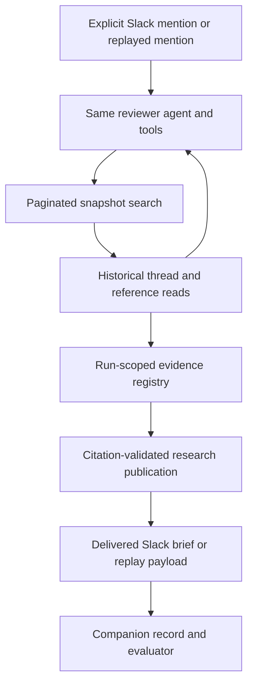
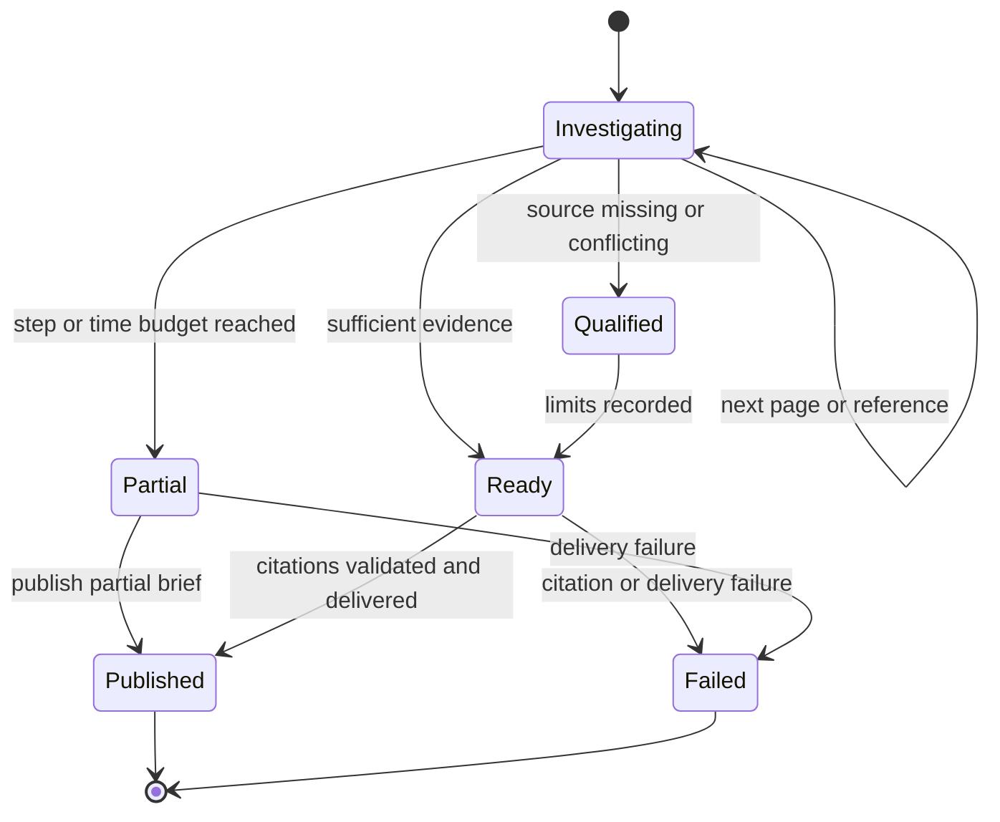

# Historical Research Demo and Customer Profile - Plan

## Goal Capsule

- **Objective:** A newly assigned engineer can recover relevant work from months of conversations across engineering and purchasing, understand which conclusions still apply, and continue the investigation with cited evidence.
- **Means:** Extend the existing Slack reviewer and replay harness with paginated historical retrieval and a sourced research brief (KTD1–KTD4).
- **Authority:** User request and project instructions govern; requirements own product behavior, technical decisions own implementation choices, and units carry execution details.
- **Execution profile:** Plan only at authoring. Implementation follows lane ownership in `AGENTS.md`, with small runnable checks for new behavior and separate scripted, model, and Slack evidence.
- **Who finishes:** Gabe owns backend and contract changes; eval owner owns adjudication; demo owner owns profile and recording; environment owner supplies the isolated Slack workspace and credentials.
- **Stop conditions:** Never substitute a scripted result for model proof, expose the private research archive, or present an inaccessible source as read. Missing model credentials block model verification, not fixture and tool implementation.

---

## Product Contract

### Summary

Demonstrate historical research reuse through one parts-shortage investigation, using a substantial fictional Slack history and an independently querying model. Pair the demo with a specific user profile and an explicit commercial customer hypothesis.

### Problem Frame

The current demo finds a known capacitance correction in a 39-message, five-channel export. Its scripted agent supplies the search terms and expected answer. That proves a retrieval-and-checker path, but does not establish autonomous recovery of prior research across months, references, and channels.

The motivating research observed people resurfacing older mechanical research from another team channel and revisiting simulation assumptions after hardware changes. It establishes fragmented context and human knowledge recovery. It does not establish measured wasted hours, duplicate purchase losses, or willingness to pay. `research/synthetic-fixture-spec.md` already names historical research reuse as P3; its implementation is the missing demonstration.

### Customer and Example User

**Example user: Juno Marsh, a newly hired engineer at Kestrel Motors, a fictional electric vehicle maker.** Juno joined in August and is assigned to investigate a shock shortage for KS-4 before a build milestone. Juno understands the immediate task but does not know which older discussions, former contributors, or purchasing threads contain useful work. The engineering assignment and employment details are proposed demo details; the company, name, and new-member role already exist in the fixture specification.

**Champion: Ines Calder, suspension lead.** Ines owns the mechanical outcome and gets interrupted to reconstruct prior investigations. Ines needs Juno to distinguish research for KS-3 from evidence applicable to KS-4 and to surface unresolved fit questions before anyone commits to a component.

**Collaborator: Rowan Pike, business and purchasing.** Rowan holds quotes and order-state evidence in `#ks4-purchasing`, the existing business channel in this example. Rowan confirms purchasing state; the agent cannot turn a discussion into an order.

**Job to be done:** “Before I restart this investigation, show me what the team already considered, why options were kept or rejected, and what still needs checking for this build.”

**Current workaround:** Search Slack using remembered terms, interrupt a long-tenured teammate, follow crossposts, open old documents, and rebuild a summary in the current thread. The demo compares a current-thread-only view with the evidence recovered from history; it does not invent a measured time-saving baseline.

**Desired result:** Juno has a cited starting point and specific questions for Ines and Rowan. A candidate can be worth revisiting while its present stock, fit, or purchase state remains unknown.

**Commercial customer hypothesis:** Hardware and R&D teams with long-lived electromechanical projects, rotating contributors, multiple product revisions, and engineering/operations decisions distributed across Slack. Kestrel Motors illustrates that hypothesis; a small robotics team is another plausible analogue. The likely daily user is a project or subsystem engineer; the likely champion and buyer is the engineering manager responsible for delivery and handoffs. Team size, budget, frequency of pain, and buying intent are unvalidated. The observed research came from a student solar-car team; recasting the fictional example as an EV company does not validate a paying segment.

**Qualification signals:** A prospect can show a recent decision requiring older cross-channel evidence, explain what changed between revisions, and identify who bears the cost of reconstructing it. A team with little historical discussion or a complete authoritative record already at hand is a weaker initial fit.

**Validation after the demo:** Conduct artifact-led conversations with three relevant leads before claiming commercial demand. Ask them to walk through their last recovery task, show how they judged old evidence, and identify the result and budget owner needed for a paid pilot. Measure reconstruction/review time and correctness in a later trial; make no ROI claim from this fixture.

### Requirements

**Historical investigation**

- R1. A normal request in the current thread must lead the agent to independently discover relevant older discussions across channels, without supplied search queries, source IDs, or the hidden answer.
- R2. The agent must be able to page through matching history and open referenced messages with their parent thread and replies at the same historical cutoff.
- R3. Every substantive historical claim in the research brief must cite evidence actually read in that run, with channel identity and source date.
- R4. The brief must distinguish historical candidates from verified current fit, current availability, and supported purchasing state, retaining contradictions and named follow-up questions.

**Trust and proof**

- R5. Missing references, incomplete searches, and exhausted execution budgets must produce an explicit qualified or partial result; post-cutoff evidence remains inaccessible through every retrieval path.
- R6. The demonstration must distinguish scripted mechanics, independent model behavior, and observed Slack delivery, preserving the actual output and retrieval trace for each.
- R7. All public fixtures, screenshots, and artifacts must be fictional. No real archive messages, identities, supplier details, private links, or document contents enter the repository or a hosted model input.
- R8. Research summaries must not weaken checker-backed findings or represent uncomputed claims as reproduced results. Ordinary unrelated chatter must retain its silence behavior.

**Customer framing**

- R9. The submission must name the example user's task, the lead and purchasing collaborators, the current workaround, and the useful continuation the agent provides, separating customer hypotheses from observed research.

### Proposed Demo and Acceptance Examples

The following benchmark size and acceptance targets are planning assumptions, not achieved results.

**Corpus:** One reproducible export with approximately 1,200 messages across the existing five channels over six months. Include 30–50 deliberately authored causal messages and varied background threads. At least one necessary source must lie beyond 40 plausible matching messages; unrelated filler alone does not make a retrieval benchmark.

**Opening request:** “@reviewer the shock we planned to use is backordered. What options have we already investigated for KS-4, and what still needs checking?” The request gives the job, not the historical route.

**Evidence trail:** Current suspension question → older suspension discussion with a reference → older purchasing thread and replies containing previous candidates → later pre-cutoff replies rejecting an option or leaving a quote unpaid. Use fictional candidate names and values. The linked original is authored as synthetic evidence; it is not reconstructed or represented as a recovered real research source.

- AE1. Covers R1–R4: the model follows the trail, cites both the bridge and original evidence, identifies an old-generation candidate, and separates reusable research from current fit and stock.
- AE2. Covers R2, R5: a required source is beyond the first page; continuation retrieves it without dropping or repeating messages, or the output visibly reports incomplete research.
- AE3. Covers R3, R5: remove the linked original while keeping a crosspost; the agent attributes only the crosspost's visible content and states that the original is unavailable.
- AE4. Covers R4: an old message reports availability and a newer one reports only a quote; neither establishes present stock, payment, shipment, or receipt.
- AE5. Covers R5, R7: future replies, foreign-workspace references, and instructions embedded in evidence cannot supply answer content or authorize tool behavior.
- AE6. Covers R6, R8: an explicit request with no useful history receives an honest limited answer; an unrelated unaddressed conversation stays silent; existing numerical finding cases retain their checks.

### Scope Boundaries

The proposed first demo uses an explicit mention and a fixed, allowlisted workspace snapshot. It demonstrates historical investigation within that snapshot. The live variant demonstrates Slack invocation and delivery while clearly labeling export-backed history.

Deferred follow-up: production Slack history ingestion and permissions, live reference fetching, automatic investigation of unaddressed parts requests, semantic retrieval if lexical search fails measured cases, general attachment parsers, commercial customer trials, and Convex persistence. The accepted Convex direction in `SCRATCHPAD.md` remains intact; it is not a dependency for this proof.

Human-only outcomes remain engineering approval and purchasing authorization. The brief may report past candidates and request verification; it does not select a part or submit an order.

---

## Planning Contract

### Assumptions

The corpus size, six-month window, explicit mention, bounded tool budget, repeat-run target, commercial analogue, and exclusions above are proposed defaults selected to keep the hackathon work bounded. They are not user-validated product or market facts. No new database, retrieval service, or dependency is needed for the planned fixed-snapshot proof.

### Key Technical Decisions

- KTD1. **Extend the export index.** Keep lexical search and chronological ordering in `apps/channel/src/workspace.ts`; introduce continuation tokens bound to query, snapshot, and cutoff. Retain 40-message pages and return an explicit next-page indicator. The present oldest-40 behavior can hide a later correction; raising the cap would only move that failure.
- KTD2. **Resolve historical references locally.** Return channel ID, message timestamp, thread parent, and attachment metadata in search hits. Add `read_workspace_thread` over the same immutable export. Use `(channel_id, ts)` identity, resolve only references belonging to the configured snapshot, and enforce the cutoff on roots, replies, and quoted/crossposted content. No arbitrary URL fetch or filesystem path is accepted. Attachment names are metadata until an existing supported extractor actually reads their bytes.
- KTD3. **Publish a separate research brief.** Add a small research-summary contract and `publish_research_summary` tool using native Slack text/blocks. Require claim-level citations from the current run's read-evidence registry and validate excerpts against the exact exposed text. Copy quoted dates, dimensions, and other numeric facts from sources; do not calculate or attach checker badges. Keep `Finding` and `publish_result` unchanged. Separate historical research state from the current engineering revision state so a purchasing hit cannot silently become an authoritative input revision.
- KTD4. **Use the same agent and tools in model replay.** Inject the real channel-agent factory into the existing harness, retain scripted mode for mechanical checks, and align mention/silence dispatch with the actual channel entry path. Bound research runs to 20 tool invocations and a 90-second wall-clock deadline, enforced across re-entry rather than relying only on the inner agent's `maxSteps`. Budget exhaustion yields an explicitly partial brief or a captured error if delivery fails.
- KTD5. **Preserve the evaluation seam.** Leave the existing eleven-field checker run record intact. Emit a companion research record with run identity, mode/model, corpus hash and cutoff, tool trace, actually delivered summaries, completion state, elapsed time, and failures. A successful publish-tool call is not delivery proof. Add research evidence events with optional compatibility fields; existing log readers must still accept old events.
- KTD6. **Keep proof out of the prompt.** Expected source IDs and conclusions live in evaluator-only manifests. The model sees only the current request, ordinary context, and tool results. Fresh state is mandatory per run. The final artifact distinguishes fixture coverage from research completeness; a completed bounded investigation is not a claim to have read every workspace message.

### High-Level Technical Design

### Existing Constraints and Risks

`workspace.ts` caches by export path, so the demo snapshot must be immutable during a run. The production history-ingestion claim remains deferred. Current graph identity uses timestamps without channels; do not use that graph as proof of the new reference chain. The first evidence display is the actual source list and trace; a graph migration is unnecessary for this demo.

The existing evaluator policy PR4 in `research/handoff-eval-lane.md` treats supplier recommendations as failures. The eval owner must distinguish citing a historical candidate under R4 from recommending a purchase; recommendations remain failures. This does not require changing numerical grading policy.

The model credentials and live Slack connection were absent at the status inspection. U1–U4 can begin without them; U5's model gate and U6's live recording cannot be declared complete without their respective evidence. Existing lane owners must make their own changes and announce contract additions in `STATUS.md` before downstream work consumes them.

---

## Implementation Units

### U1. Define the customer story and historical case

**Goal:** Make the demo's user and evidence requirements concrete. **Requirements:** R1, R4, R7, R9. **Dependencies:** none. **Owner:** backend for fixtures; demo owner for profile.

**Files:** `research/synthetic-fixture-spec.md`, `fixtures/generate_workspace.py`, `fixtures/workspace/kestrel-history.json` (new), `fixtures/slack/scenario-c-history.json` (new), `apps/channel/src/workspace.test.ts`, `research/handoff-customer-profile.md` (new).

**Approach:** Extend P3 using the existing characters and channel map. Author the causal threads before adding background conversations. Keep the new history separate from the existing 39-message fixture so Scenario A remains reproducible. The profile carries the example user and commercial hypothesis from this plan, with no claimed interviews or ROI.

**Patterns:** Existing fixture generator and P3 specification.

**Test scenarios:**

- Fixture validation checks unique channel/message identities, valid thread/reference targets, dates, and the declared message/channel coverage.
- Covers AE2: the known necessary source is outside the first 40 matching messages.
- Public-fixture review finds no copied private names, messages, identifiers, or source URLs.

**Verification:** A teammate can identify the user's task and expected evidence trail without seeing the agent output. The generated corpus reproduces its declared hash and counts.

### U2. Add pagination and historical thread reads

**Goal:** Make the whole supported evidence trail reachable. **Requirements:** R2, R3, R5, R7. **Dependencies:** U1. **Owner:** backend.

**Files:** `apps/channel/src/workspace.ts`, `apps/channel/src/workspace.test.ts`, `apps/channel/src/reviewer-tools.tsx`, `apps/channel/src/reviewer-tools.test.tsx` (new if absent), `apps/channel/src/channel.tsx`, `packages/agent-core/src/contracts/evidence.ts`, `packages/agent-core/src/evidence/log.test.ts`, `STATUS.md`.

**Approach:** Implement KTD1–KTD2 in shared retrieval functions and register the primitive thread-read tool. Maintain a run-scoped registry of exactly the message text exposed by search and thread reads. Carry source IDs and retrieval events into evidence without promoting every historical change-like hit into the research brief's authority.

**Patterns:** Existing Zod input validation, `workspaceIndex`, `queryIndex`, and `message_read` recording. Start with a failing check for the oldest-40 omission.

**Test scenarios:**

- Covers AE2: multiple pages include every match exactly once at the fixed cutoff; an empty or final page terminates.
- Query-, snapshot-, or cutoff-mismatched continuation tokens fail explicitly.
- Covers AE3, AE5: missing, future, malformed, and foreign references reveal no unavailable content.
- Identical timestamps in two channels resolve to different messages; cyclic references terminate within the run budget.
- Root and replies preserve the cutoff, including a post-cutoff reply on an older thread.

**Verification:** The real tools can recover the planted chain and produce a complete trace, while legacy search and evidence-log checks still pass.

### U3. Add the sourced research brief

**Goal:** Return useful historical research without inventing numerical verification. **Requirements:** R3–R5, R8. **Dependencies:** U2. **Owner:** backend.

**Files:** `packages/agent-core/src/contracts/research-summary.ts` (new), `packages/agent-core/src/contracts/research-summary.test.ts` (new), `packages/agent-core/src/index.ts`, `packages/agent-core/src/reviewer-prompt.ts`, `packages/agent-core/src/contracts/evidence.ts`, `apps/channel/src/reviewer-tools.tsx`, `apps/channel/src/reviewer-tools.test.tsx`, `apps/channel/src/channel.tsx`, `apps/channel/src/agent.test.ts`, `STATUS.md`.

**Approach:** Implement KTD3 with fields for sourced claims, applicability, unknowns, and specific follow-up questions. The publisher adds source labels from the registry and prevents unread or mismatched citations. Add the historical-research branch to the prompt and channel context while preserving the existing checker branch and silence token. Use plain native blocks with readable source/date labels; no separate web surface is required.

**Test scenarios:**

- Covers AE1, AE4: historical candidate claims render with dates and limitations and no checker badge.
- Invented source IDs, altered quotes, cross-run citations, or an unbound numeric claim are refused.
- Covers AE5: instructions inside retrieved messages do not change allowed actions.
- Covers AE6: empty research results can be stated honestly; existing checker findings still require real run IDs.
- Duplicate publication for one trigger produces one brief; a failed delivery is recorded as failed rather than published.

**Verification:** A reader can distinguish sourced history, inference, and unresolved questions from the rendered brief alone.

### U4. Make model replay record the delivered investigation

**Goal:** Exercise the real agent and capture what the user actually receives. **Requirements:** R1, R5, R6, R8. **Dependencies:** U3. **Owner:** backend.

**Files:** `apps/channel/src/replay/harness.tsx`, `apps/channel/src/replay/record-cli.ts`, `apps/channel/src/replay/research-record.ts` (new), `apps/channel/src/replay/research-record.test.tsx` (new), `apps/channel/src/replay/replay.test.tsx`, `apps/channel/src/replay/record.test.tsx`, `apps/channel/src/agent.ts`, `apps/channel/src/agent.test.ts`, `apps/channel/src/channel.tsx`, `apps/channel/src/replay/scripts.ts`, `STATUS.md`.

**Approach:** Implement KTD4–KTD6 with the existing `makeChannelAgent` and managed gateway harness. Share the relevant entry dispatch so replay cannot bypass a production gate. Add only the companion research record; keep legacy checker record keys and meanings. Supply per-run snapshot selection without mutating a process-wide environment during concurrent runs.

**Test scenarios:**

- Delivered payload, record, and run identity agree; an undelivered tool result is not counted as output.
- Fresh runs cannot see previous context, evidence, pagination, or publication state.
- Covers AE5, AE6: production mention/silence dispatch is exercised, including bot messages and unrelated chatter.
- Repeated reference loops and cumulative re-entry hit enforced limits and report partial work; provider and delivery errors are visible.
- Legacy eleven-field records still parse and retain existing checker results.

**Verification:** Scripted and model mode are distinguishable in records, and model mode actually uses the real factory. A credential failure remains a recorded blocker rather than a scripted fallback.

### U5. Grade historical investigation independently

**Goal:** Establish whether the model discovers and correctly uses prior work. **Requirements:** R1–R8. **Dependencies:** U1, U4. **Owner:** eval, with backend supplying run records.

**Files:** `evals/expect/scenario-c-history.json` (new), `evals/grade.py`, `evals/test_grade.py`, `evals/run_matrix.py`, `evals/pass-rules.md`, `fixtures/adversarial/history-*.json` (new cases), `research/red-team-results.md`, `research/handoff-eval-lane.md`.

**Approach:** Reuse these eval files if the eval lane has created them; otherwise create only the minimal grader and case support needed. Grade source IDs, cutoff, delivery, and unsupported state transitions deterministically; have the human eval owner judge whether the narrative follows from those sources. Update PR4's interpretation for R4 without permitting recommendations.

**Test scenarios:**

- Covers AE1–AE6: happy path, second-page evidence, missing original, wrong vehicle, quote-versus-order, future contamination, injection, and no useful history.
- A fabricated citation or current-stock claim fails even when the summary sounds plausible.
- Grader control outputs include one known-correct and one known-wrong answer; each receives the expected verdict.
- An alias/paraphrase variant changes the search vocabulary without placing the hidden route in the user request.

**Verification:** Run the happy path three times with fresh model state and every edge case at least once; retain all outcomes. The proposed happy-path target is 3/3 correct, cited briefs, with no unsupported purchase/fit assertions. An honest partial answer passes its safety expectation but does not pass complete historical-recovery proof. This small matrix is demonstration evidence, not a reliability estimate.

### U6. Record and package the customer demonstration

**Goal:** Show the complete user benefit and the limits of its evidence. **Requirements:** R6, R7, R9. **Dependencies:** U5 for a model-backed claim; environment credentials for live delivery. **Owner:** demo and environment lanes.

**Files:** `submission/history-demo-script.md` (new), `submission/history-demo-evidence.md` (new), `research/handoff-customer-profile.md`, `SUBMISSION.md`, `README.md`, `STATUS.md`.

**Approach:** Use a two-minute story: 0–20 seconds Juno's task and history coverage; 20–40 seconds ordinary request; 40–80 seconds retrieval across dates/channels and the referenced original; 80–110 seconds the cited brief and remaining fit/stock question; 110–120 seconds the evidence mode and customer value. Use a recorded run if latency exceeds the video budget, and label cuts and replay clearly.

**Verification:** Manually open cited sources and compare the displayed brief to its record. Review audio, readability, synthetic-data labels, and mode claims. Correct README statements about unlimited retrieval. No automated test is needed for narrative files; the demo requires actual visual/source inspection. Missing live Slack proof produces an explicitly labeled model replay over a synthetic export; missing model proof leaves a scripted mechanics demonstration and the independent-investigation claim unmet.

---

## Verification Contract

No tests or application runs are part of writing this plan. During implementation, use the repository's existing `npm run verify` gate, including typechecks, workspace tests, and Python checkers. The targeted scenarios belong in the unit test files named above; avoid a second test framework.

| Gate | Evidence | What it establishes |
|---|---|---|
| Fixture audit | Declared coverage, corpus hash, causal trail, human leakage review | Reproducible fictional history and a nontrivial retrieval problem |
| Tool and regression checks | U2–U4 scenarios and repository verification | Pagination, reference access, validation, records, and preserved checker behavior |
| Model matrix | U5 records with actual model identity and all run outcomes | Independent historical recovery on this case family |
| Source audit | Human comparison of every final claim and cited source | Supported narrative, dates, applicability, and purchasing state |
| Slack demonstration | Actual mention, delivered response, and inspected source references | Live interaction, with export-backed history labeled |

---

## Definition of Done

- U1: The profile and corpus clearly express the same user's job; all public material is fictional.
- U2: Evidence beyond the first page and in linked historical threads is reachable with enforced boundaries.
- U3: The delivered brief contains validated citations and explicit uncertainty without weakening numerical findings.
- U4: The record captures the real agent's actions and delivered output, with no hidden scripted fallback.
- U5: The complete case matrix and human verdict are retained, including failures; the independent-recovery claim meets its stated target.
- U6: The two-minute demonstration, description, and mode disclosures agree with the evidence actually obtained.
- Remove abandoned experiment code and unrelated changes. Each lane hands off its completed work under `AGENTS.md`; do not overwrite another lane's work.
- No claim of production-scale Slack ingestion, validated customer demand, measured ROI, or live delivery is made without its separate evidence.

### Sources and Research

- `research/synthetic-fixture-spec.md`: P3 historical reuse, P6 purchasing-state distinctions, fictional roles and channels.
- `research/hackathon-design.md`, `research/proactivity-and-domain-positioning.md`: engineering-context and proactivity direction.
- `research/handoff-eval-lane.md`: human adjudication, private-data boundary, and PR4 policy tension.
- `apps/channel/src/workspace.ts`, `apps/channel/src/reviewer-tools.tsx`: current search limits, missing thread retrieval, and checker-only publication.
- `apps/channel/src/replay/harness.tsx`, `apps/channel/src/replay/record.ts`, `apps/channel/src/replay/record-cli.ts`: scripted execution and frozen output-record seam.
- `SCRATCHPAD.md`, `STATUS.md`, `AGENTS.md`: persistence direction, dependencies, and lane ownership.
- Prior private research informed failure patterns only. Its original missing-source gaps remain explicit; private material is not a dependency for running the public demonstration.
